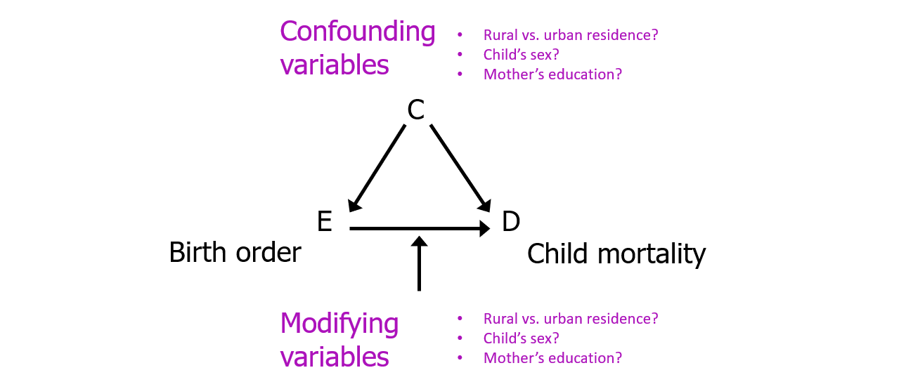
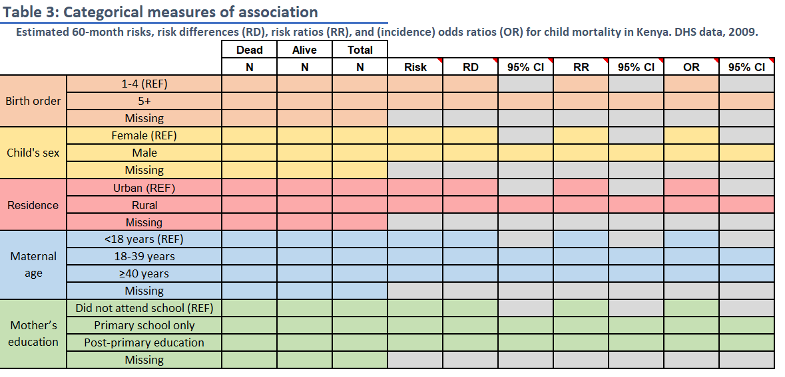
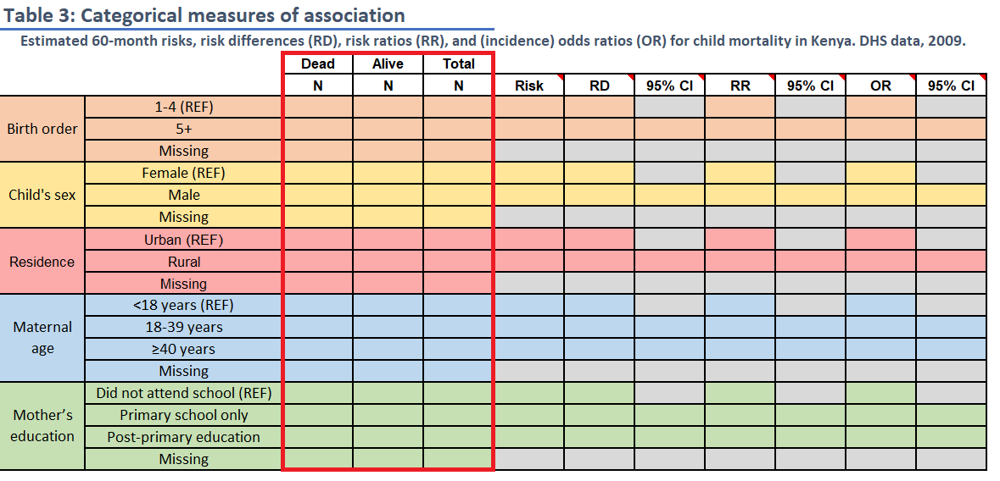
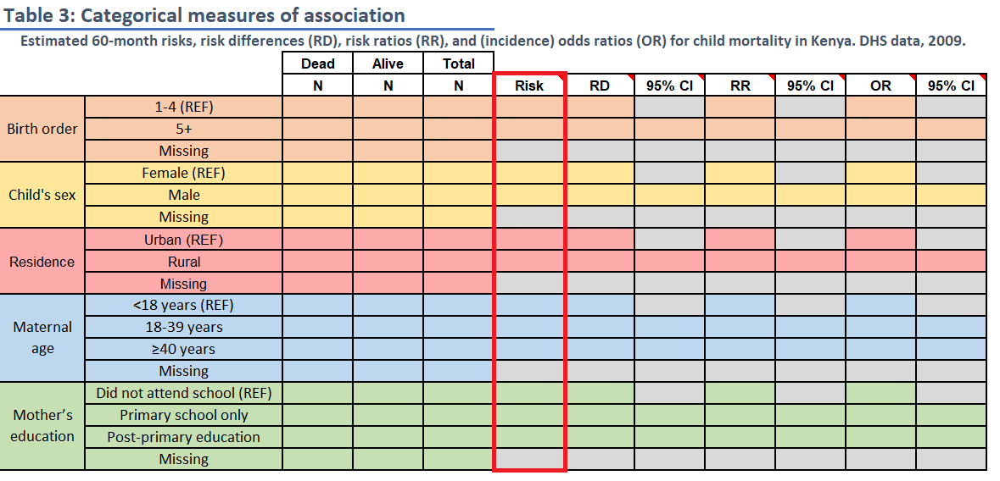
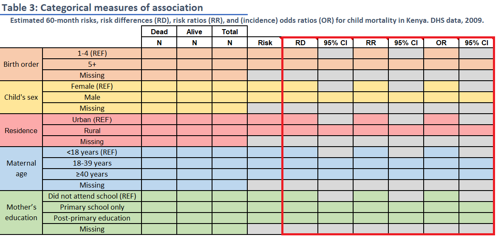
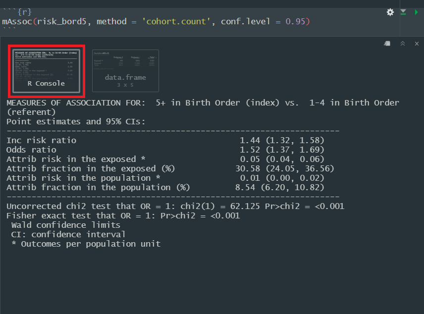

```{r setup, include=FALSE}
knitr::opts_chunk$set(echo = FALSE)

library(tidyverse)
library(knitr)
library(xaringanExtra)
```

```{r xaringanExtra-clipboard, echo=FALSE}
xaringanExtra::use_clipboard()
```


### LAB MATERIALS

* [__R Markdown file for Lab 3__](assignments/lab3_705[assignment].Rmd)
Click link to download. Fill it in with your answers to the following lab tasks. When you're ready to submit, name it as `Lab3_FirstinitialYourlastname.Rmd`, and submit it using the Sakai dropbox.

* [__Excel document with Tables 1, 2, and 3__](assignments/lab3_705_tables.xlsx)

* Lab_3_kenya.rds - data file available on Sakai

### Lab 3 Goals

* Assess the bivariate relationships between outcome and covariables and the statistical association between each of the two variables

* Estimate the epidemiologic measures of association (risk difference, risk ratio and odds ratio) between risk factors and outcome

### Lab 3 Grading scheme

| Competency | Points |
|:-----------|:------:|
|   .Rmd file runs without error |   10 |
|   Task 3 (Table 1) |   5 |
|   Task 4 (Table 2) |   10 |
|   Task 5 (Table 3) |   20 |
|   Task 6 (stratified boxplots) | 10 (5 each) |
|   Task 7 (short answer)    |   5   |
|   Task 8 (short answer) |  10 |
|   Task 9 (short answer) |   5 |
|   Task 10 (short answer) |   5 |
|   Task 11 (short answer) |  20 |
|   __Total__  |  __100__  |

<aside> Late policy: 5 point deduction per 24 hour period past due date and time </aside>


## Task 1: Load libraries and dataset

For this assignment, we'll need packages {tidyverse}, {skimr}, {epiR}, {tableone}, and {epiAssist}

For your data, you will use the dataset `Lab_3_kenya.rds`, located in the Sakai Resources folder for this course.  This has all of the variables that we've created in labs 0, 1, and 2, and only contains those observations in our closed cohort (n = 16,828).

## Task 2: BIG PICTURE 

#### Just think on this for a moment. Internalize it. Come back to it:

For this and subsequent labs, we are considering

  1) Child mortality within 5 years as our outcome (response) variable  
  2) Birth order >= 5 as the main risk factor variable and  
  3) Other variables as potential *__confounders__* or *__modifiers__* of the relationship between mortality and birth order. 
  



## Task 3: Table 1 

### Tabular analysis of continuous variables by mortality status

__INSTRUCTIONS:__ Fill in `Table 1` with the descriptive statistics for maternal BMI (`mbmi`) and maternal age (`mage`), overall and by the two levels of child mortality within 5 years (`death`). 

<aside>Reminder that you can find Tables 1-3 in the Excel file provided in the [Lab Materials](https://dghi-biostat.github.io/biostatlab/docs/705_lab_3.html#lab-materials) for this lab </aside>

This table also requires you to use R to calculate statistical tests (T-test and Kruskal-Wallis) of the association between the outcome, `death`, and maternal BMI and age (i.e., comparing the distributions of maternal BMI and maternal age for the children who died versus those who were alive).  

Round p-values to 3 decimal places.

Read on for advice on how to generate overall and stratified summary statistics, as well as instructions for how to perform the two statistical tests.
 
### Overall summary statistics for each variable variable

The skim() function provided by {skimr} makes this task a simple one. However, unlike previous labs where we ran a summary on the entire dataset, in this task we want individual variables. To keep your output clean, we recommend you generate your summary statistics only for the variables of interest.

We can use [a pipe](https://dghi-biostat.github.io/biostatlab/docs/help_jargon.html#magrittrpipe) with skimr() to call specific variables, like this:

```{r eval = FALSE, echo = TRUE}
data %>%
  skim(variable)

```

### Stratified summary statistics

Since we're already doing things in a pipe, we can use the filter function to retrieve summary statistics based on mortality status. To stratify by the variable `death`, we should add the `group_by()` function to our pipeline, specifying that we want to "group by `death`, then skim the variable `mbmi`":

```{r eval = FALSE, echo = TRUE}

data %>%
  group_by(death) %>%
  skim(mbmi)

```

__Note__: Table 1 asks for counts of records with mbmi and mage data available vs. those missing, both overall and by the 2 levels of `death` (i.e. dead and alive). If you look closely, this means that we need counts of counts of kids with data available on `mbmi` and `mage`, overall, within levels of death, and those missing values. `skim()` does not give you raw counts of the variable `death` that account for those missing values.

Use `table()` or a pipe, `group_by()` and `count()` to get the counts of children in each group  of `death` (i.e. by levels of `death`). Then use the column of your skim output, `n_missing`, to subtract missing values from groups 


### T-tests and Kruskal-Wallis tests

T-tests and one of their nonparametric cousins, Kruskal-Wallis, can be used to compare means between between groups (i.e. between sub-populations), with the null hypothesis (H~0~) being that all means are equal.

There are a few simple functions from the {stats} package that we can use to manually run these tests. To implement, we use functions `t.test()` and `kruskal.test()`. Both take the same arguments: 

<aside> Many functions in R can perform a task like generating tables, while computing a p-value as a matter of course (see [Task 4](https://dghi-biostat.github.io/biostatlab/docs/705_lab_3.html#task-4-table-2] below). </aside>

  1. A formula: `depVar ~ indepVar`
  2. A data frame

  
In this case, we are interested in knowing whether or not the means for __mbmi__ and __mage__ differ by strata of child mortality status, __death__. 

What this means is that when we're building our formula, the "y"/dependent variable (the resulting means), should be on the left, while the "x"/independent variable (a categorical stratifying variable), should be on the right. 

<aside> Formulas: In R, "formulas" follow different rules depending on the function. As a general rule, most take the form `y ~ x`. [Go here to learn more](https://www.datacamp.com/community/tutorials/r-formula-tutorial). </aside>

#### Example of T-tests and Kruskal-Wallis

As an example, we might use the `starwars` dataset, available through the {dplyr} package (in the tidyverse), to inspect the body mass of different characters by gender. Let's take a look at the raw data:

```{r}
kable(head(starwars[1:11]))
```


Our formal question might look like this: "Does mean character height differ by a character's gender?" (For the purposes of example, assume that the 83 characters are a sample from a large population of characters)

We can calculate summary statistics for sub-group frequency counts and means:

```{r echo = TRUE, eval = FALSE}
starwars %>%
  filter(!is.na(gender)) %>%
  group_by(gender) %>%
  summarize(n = n(), mean = mean(height, na.rm = TRUE))
```

```{r}
kable(starwars %>%
  filter(!is.na(gender)) %>%
  group_by(gender) %>%
  summarize(n = n(), mean = mean(height, na.rm = TRUE)))
```

We can also visualize the respective distributions of `height` by `gender` using density plots.


```{r warning = FALSE, message = FALSE}
x <- starwars %>%
  filter(!is.na(gender)) %>%
  group_by(gender) %>%
  summarize(meanheight = mean(height, na.rm = TRUE))

starwars %>%
  filter(!is.na(gender)) %>%
  ggplot(aes(x = height)) +
  geom_density(aes(fill = gender), alpha = 0.4) +
  geom_vline(xintercept = c(x$meanheight), linetype = 'dashed', color = 'red') +
  labs(x = 'Height', y = NULL, fill = "Gender")
```

<aside>The hypotheses of the two-sample t-test ask whether the mean height of feminine and masculine are different. To address this question, data from the 17 feminine and 66 masculine characters are used as samples drawn from the larger population.</aside>


Our t-test would effectively tell us whether or not the observed difference in sample mean of height supports the conclusion that the population mean height is different between the two groups.

```{r echo = TRUE, eval = FALSE}
t.test(height ~ gender, data = starwars)

#>	Welch Two Sample t-test
#>
#> data:  height by gender
#> t = -1.5596, df = 37.315, p-value = 0.1273
#> alternative hypothesis: true difference in means between group feminine and group masculine 
#> is not equal to 0
#> 95 percent confidence interval:
#>  -27.191682   3.534423
#> sample estimates:
#>  mean in group feminine mean in group masculine 
#>                164.6875                176.5161 
```

<aside>Function output is indicated by lines that start with `#>`</aside>

However, since the category for `gender == 'feminine'` only contains 17 observations, we might decide that a nonparametric test (one that doesn't assume a normal distribution), might be more appropriate for the small sample size. In this case we can use the Kruskal-Wallis test:

```{r echo = TRUE, eval = FALSE}
kruskal.test(height ~ gender, data = starwars)

#> Kruskal-Wallis rank sum test
#> 
#> data:  height by gender
#> Kruskal-Wallis chi-squared = 8.6845, df = 1, p-value = 0.003209
```

<aside>Note that our decision tree for statistical tests of continuous outcome variables would get us to the Wilcoxon Rank Sum Test. In R, this is implemented the same as the Kruskal Wallis test, but uses the function `wilcox.test()`. We have used `kruskal.test()` because this is the test we will perform for Table 1. </aside>

Notice the difference in the conclusion you would draw from either test. For the t-test, we should conclude that we cannot reject the null hypothesis, whereas the nonparametric test tells us that there is a statistically significant difference in the mean height of the two groups. 


### Tabular analysis of categorical variables by `death`

__INSTRUCTIONS:__ `Table 2` contains three distinct columns for frequency counts and percentages. 

The first, "All Children" requires the __overall__ frequency counts and percentages by the categorical variables of interest. These are the same values that you generated for Table 1 in both labs 1 and 2.

The next two columns, "Dead" and "Alive", require frequency counts and percentages of each of the variables of interest, stratified by mortality status at 5 years, `death`. 
Be sure to calculate percentages only for the non-missing values and round percentages to 1 decimal place. 

This table also includes statistical measures (Chi-Sq and Fisher’s exact test) of the association between mortality status and the variables in the table.

Round p-values to 3 decimal places.

### {tableone} package

We will complete this task by first using the package {tableone}, a powerful tool for tabular analysis, especially for stratified analyses like this one.

<aside> __More on {tableone}:__ Find a full tutorial of {tableone} [here](https://cran.r-project.org/web/packages/tableone/vignettes/introduction.html) </aside>

The function `CreateTableOne()` will create a {tableone} object that generates mean and standard deviation for continuous variables, and frequency counts and percentages for factor variables.

`CreateTableOne()` requires several arguments of central importance for it to run:

  1.) `vars =` - a vector of variable names, written as strings  
  2.) `strata =` - a categorical variable for stratifying (if desired)  
  3.) `data = ` - your data frame  
  4.) `factorVars =` - used to convert character variables to factors on the fly
  
  
<aside> __factorVars:__ You shouldn't need to use `factorVars = ` for your `kenya` data, since we have already converted categorical variables to factors in the previous labs. </aside>

### Create a vector of variables

For starters, we'll need a vectorized list of our variables of interest, written as strings (in quotes). 

As an example, we might use the derived variables in our kenya dataset for `size` and `pnc`. To make our code more readable, we will create a vector object that contains both variable names. To do this, we put both variable names in quotes, separating them by commas within a vector, `c()`. Then we need to assign the vector a name so that we can call it later. Here, we've named the vector `variables`. 

```{r eval = FALSE, echo = TRUE}
variables <- c('size', 'pnc')
```

### Construct {tableone} objects

First, we will construct two different {tableone} objects: a "simple" table with univariate frequency counts, and a "stratified" table, with bivariate counts.

After that, we'll use `print()` to view the output generated by those two different objects.

#### Simple table

For a simple table of summary statistics, we only need to use arguments `vars = ` and `data = `. It's best practice to assign the {tableone} object to a name, so that we can use it in a `print()` function in a moment. 

```{r eval = FALSE, echo = TRUE}
simple_tab <- CreateTableOne(vars = variables, 
                             data = kenya)
```

#### Stratified table

We may also want to stratify our results by a second variable, like `bord5`.


```{r eval = FALSE, echo = TRUE}
stratified_tab <- CreateTableOne(vars = variables, 
                                 data = kenya, 
                                 strata = 'bord5')
```

### Print table

We can then use a `print()` function, with arguments specific to our {tableone} object, to view our simple and stratified tables. 

With categorical variables, it's typically best to use the argument `showAllLevels = TRUE` so that we see every category. 

<aside> Setting `showAllLevels` to `FALSE` will leave out the reference level for each variable. </aside>

#### Print simple table

```{r echo = TRUE, eval = FALSE}

print(simple_tab, showAllLevels = TRUE)

#>              level                  Overall      
#>  n                                   16828        
#>  size (%)     Very large                26 ( 7.4) 
#>               Larger than average       76 (21.7) 
#>               Average                  158 (45.1) 
#>               Smaller than average      65 (18.6) 
#>               Very small                25 ( 7.1) 
#>  pnc (%)      No prenatal care          15 ( 9.1) 
#>               Received prenatal care   149 (90.9) 

```


#### Print stratified table with chi-square test of independence

Whereas the simple table prints overall frequency counts and percentages, our stratified table will take the stratifying variable (in the case of this example, `bord5`), and perform a chi-square test of independence for that stratifying variable and each of the variables of interest e.g. of `size` and `pnc`:

```{r echo = TRUE, eval = FALSE}

print(stratified_tab, showAllLevels = TRUE)

#>              Stratified by bord5
#>               level                  1-4 in Birth Order 5+ in Birth Order  p     test
#>  n                                   13263              3565                         
#>  size (%)     Very large                23 ( 9.3)          3 ( 2.9)        0.157     
#>               Larger than average       51 (20.6)         25 (24.5)                  
#>               Average                  108 (43.5)         50 (49.0)                  
#>               Smaller than average      50 (20.2)         15 (14.7)                  
#>               Very small                16 ( 6.5)          9 ( 8.8)                  
#>  pnc (%)      No prenatal care           4 ( 3.7)         11 (20.0)        0.002     
#>               Received prenatal care   105 (96.3)         44 (80.0)       

```

Note that each row of the stratified results sum to the same result as given by the column for "Overall" in our `simple_tab`. 

As the default for categorical variables, the {tableone} `print()` function performs a chi-square test of independence between `bord5' and each of the variables of interest.

There's one glaring issue here, however: neither of our stratified variables meet the assumption of normality! Each contains at least one cross-tabulation with counts that are less than 5. 

### Fisher's exact test of significance

When we look at our decision tree for hypothesis testing of categorical outcome variables, we might decide that we need to use a Fisher's Exact test when our data doesn't meet the assumption of all expected cell counts being at least 5 for a chi-square test of independence.

<aside>
You can use the output from `chisq.test()` to find expected cell counts:
```{r eval = FALSE, echo = TRUE}
size_tab <- table(kenya$bord5, kenya$pnc)
X2 <- chisq.test(size_tab)
X2$expected
```
</aside>


To do this in a {tableone} object, we just need to include `exact = TRUE` in our `print()` function to calculate a Fisher's Exact test, the nonparametric equivalent of the chi-square test of independence. 

```{r echo = TRUE, eval = FALSE}

print(stratified_tab, showAllLevels = TRUE, exact = TRUE)

#>               Stratified by bord5
#>               level                  1-4 in Birth Order 5+ in Birth Order p      test 
#>  n                                   13263              3565                          
#>  size (%)     Very large                23 ( 9.3)          3 ( 2.9)        0.141 exact
#>               Larger than average       51 (20.6)         25 (24.5)                   
#>               Average                  108 (43.5)         50 (49.0)                   
#>               Smaller than average      50 (20.2)         15 (14.7)                   
#>               Very small                16 ( 6.5)          9 ( 8.8)                   
#>  pnc (%)      No prenatal care           4 ( 3.7)         11 (20.0)        0.001 exact
#>               Received prenatal care   105 (96.3)         44 (80.0)                   

```

Although in this particular example we draw the same conclusions from the Fisher's exact test as we do from the chi-square test of independence, this will not always be the case.

<aside>
There are other arguments for {tableone} that allow you to specify exactly which variables do not meet the assumptions of the default parametric test (e.g. chi-square test of independence for categorical variables), and therefore perform the nonparametric test on only those variables. Similar steps apply for analysis of continuous variables (you could even try using the continuous variables from Task 3!)
</aside>

## Task 5: Table 3 

### Risk Differences, Risk Ratios, and Odds Ratios

__INSTRUCTIONS:__ Fill in `Table 3` with frequency counts overall and by levels of child mortality within 5 years and with the stratum-specific risk of death (these are the same frequency count values, *N*, as in Table 2). Then use `mAssoc()` to compute the risk difference, risk ratio and the odds ratio of death comparing levels for each of the 5 variables to the reference level.  



<aside> We use `mAssoc()` in the package {epiAssist} to generate these values. This function is a helper function for the original `epi.2by2()` function, which is available in the package {epiR}. `epi.2by2()` works the same as `mAssoc()`, except it only provides output for a single index/reference level pair. `mAssoc()` can do multiple index levels all at once. </aside>

The reference level for each variable is noted in the spreadsheet ("REF").  For the two 3-level variables, calculate risk differences and ratios for each non-reference level relative to the reference level.  

Round risks to 3 decimal places and ratios to 2 decimal places.  

### Take a deep breath. 

Don't let this table overwhelm you. We're going to break it down step-by-step

### Frequency counts

The frequency counts in this table align with those generated for Table 2. Feel free to use Excel equations to transfer data from sheet 2 to sheet 3.



### Risk

The value for risk should be calculated as the risk of the outcome of interest (`death == "Dead"`) according to each level of the exposure. Risk should be reported as a proportion, rounding to the third decimal. 



### Risk difference (RD), Risk Ratio (RR), and Odds Ratio (OR)



RD, RR, and OR are what are known as "measures of association" because they are used to compare outcomes between levels of a categorical variable. In epidemiology, we refer to the baseline level as the "reference level" and the comparator level as the "index level".  

In practical terms, for things like RRs and ORs, the index level goes in the numerator and the reference level goes in the denominator. 

<aside> \[\frac{index\ \ level}{reference\ \ level}\] </aside>

You can use your underlying knowledge of these measures of association to calculate our answers by hand and confirm the results that we'll obtain using the functions that follow.

### `mAssoc()` for Measures of Association

For this task, we will use `mAssoc()` to generate all three measures of association (RD, RR, and OR) in a singular output. 

To use `mAssoc()`, we must take several steps to ensure that our data is in the proper shape for our measures to be calculated appropriately:

  1.) Create a table object using `table()`  
  2.) Rearrange the table with `flipTable()` to put it in the appropriate alignment for use by `mAssoc()`  
  3.) Submit our rearranged table to `mAssoc()`. 

`mAssoc()`'s main input is a table object arranged in the following format:

```{r echo = TRUE, eval = FALSE}
#   -----------	----------	----------
#                Outcome +	 Outcome -
#   -----------	----------	----------
#     Expose +	 cell 1      cell 3          
#     Expose -	 cell 2      cell 4
#   -----------	----------	----------
```
  
As a way of demonstrating, we will use the variable `bord5`, stratified by `death` to calculate our measures of association.

#### Step 1: Create a table object with `table()`

First, we need to generate a table object and assign it a name. Keep in mind that we want our exposure variable (in this case, `bord5`) along the left side of the table and our outcome variable (`death`) at the top of the table. 


```{r echo = TRUE, eval = FALSE}
tab_bord5 <- table(kenya$bord5, kenya$death)
tab_bord5

#>                      Alive  Dead
#>  1-4 in Birth Order 11809  1454
#>  5+ in Birth Order   3002   563
```

#### Step 2: Rearrange table with `flipTable()`

Notice that `mAssoc()` takes a `table` object with the cross-tabulation of outcome of interest (Outcome +) and exposure of interest (Expose +) in the top-left cell:

<aside>Reminder that the function `mAssoc()` is a wrapper function for the `epi.2by2()` function from package {epiR}. </aside>

```{r echo = TRUE, eval = FALSE}
#   -----------	----------	----------
#                Outcome +	 Outcome -
#   -----------	----------	----------
#     Expose +	 cell 1      cell 3          
#     Expose -	 cell 2      cell 4
#   -----------	----------	----------
```


If we refer to our tableof  bord5 and death, we'll notice that it currently displays the inverse of the arrangement required by `mAssoc()`:

```{r echo = TRUE, eval = FALSE}
tab_bord5

#>                       Alive  Dead
#>  1-4 in Birth Order  11809   1454
#>  5+ in Birth Order    3002    563
```

That is, our tabulation of bord5 currently takes the following form, with "Outcome-" and "Expose-" in the top-left corner. We need "Outcome+" and "Expose+" in that corner:

```{r echo = TRUE, eval = FALSE}
#   -----------	----------	----------
#                Outcome -	 Outcome +
#   -----------	----------	----------
#     Expose -	 cell 1      cell 3          
#     Expose +	 cell 2      cell 4
#   -----------	----------	----------
```

To fix this, we can use `flipTable()`, assigning it back to the same name for the table object:

```{r echo = TRUE, eval = FALSE}
tab_bord5 <- flipTable(tab_bord5)

tab_bord5

#>                      Dead  Alive
#>  5+ in Birth Order    563   3002
#>  1-4 in Birth Order  1454  11809
```

#### Generate measures of association with `mAssoc()`

To generate our measures of association and their accompanying confidence intervals, all we need to do is submit our rearranged table to `mAssoc()`, specifying that our data is cohort data with `method = "cohort.count"`, and setting our confidence level to 0.95 with `conf.level = .95`:

```{r echo = TRUE, eval = FALSE}
mAssoc(tab_bord5, method = "cohort.count", conf.level = 0.95)

#> MEASURES OF ASSOCIATION FOR:  5+ in Birth Order (index) vs.  1-4 in Birth Order (referent)
#> Point estimates and 95% CIs:
#> -------------------------------------------------------------------
#> Inc risk ratio                                 1.44 (1.32, 1.58)
#> Odds ratio                                     1.52 (1.37, 1.69)
#> Attrib risk in the exposed *                   0.05 (0.04, 0.06)
#> Attrib fraction in the exposed (%)            30.58 (24.05, 36.56)
#> Attrib risk in the population *                0.01 (0.00, 0.02)
#> Attrib fraction in the population (%)          8.54 (6.20, 10.82)
#> -------------------------------------------------------------------
#> Uncorrected chi2 test that OR = 1: chi2(1) = 62.125 Pr>chi2 = <0.001
#> Fisher exact test that OR = 1: Pr>chi2 = <0.001
#>  Wald confidence limits
#>  CI: confidence interval
#>  * Outcomes per population unit 
```


#### Reading `mAssoc()` output:

The output of interest from `mAssoc()` will be printed to the console. You can find it by clicking on the area with a red square around it in this screenshot:


<aside> If we set `units = 100`, our attributable risk in the exposed (risk difference) would be interpretable as a difference of *x* number of outcomes per 100 people in the index level when compared to the reference level. Since our population unit is set to 1, this number is simply interpreted as an individual's risk difference of experiencing the outcome if they are in the index level of the exposure.</aside>

Here is a quick guide to the components of the output relevant to this activity:

__*Inc risk ratio*__: Our basic risk ratio  
__*Odds ratio*__: Our basic odds ratio  
__*Attrib risk in the exposed*__: The risk difference. `mAssoc()` takes another argument, `units = `, which by default is set to 1. This regulates our output for the measure of risk difference. 


#### `mAssoc()` when exposure variable has 3+ levels

Now that you've seen the code for `bord5` as an example, if you're paying close attention, you may have started to wonder, "But what about variables like `education`, when there's more than one index level?"

Good news: `flipTable()` and `mAssoc()` are designed to handle exposure variables with any number of levels. This means that the steps you take for `bord5`, `male`, and `rural` will also apply to `magec` and `education`; simple as that.

Running `mAssoc()` when your exposure variable has 2+ levels will render multiple outputs for each respective index variable. The person who wrote this function was even nice enough to label each of those levels and whether or not they are the index or the reference level.


## Task 6: Side-by-side boxplots

__INSTRUCTIONS:__ Generate boxplots of maternal BMI (`mbmi`) and maternal age (`mage`), stratified by levels of child mortality (`death`).

<aside>[Click here](https://dghi-biostat.github.io/biostatlab/docs/help_ggplot2.html#generate-a-stratified-boxplot-by-adding-a-y-aesthetic) for more help with boxplots using {ggplot2} </aside>

For this activity, we need boxplots that plot continuous variables based on child mortality. In ggplot2, we can stratify boxplots by using a second categorical variable when we specify our aesthetics (`aes()`). In other words, if you set `mbmi` to the y-axis, you can use a categorical variable, like `death` as the variable on the x-axis.

Additionally, don't forget to label your axes, give the plot a title, and save it using `ggsave()`

<aside> Within your call to `geom_boxplot()`, you can also change the color with `fill = "colorname"`. Find a list of color names [here](http://www.stat.columbia.edu/~tzheng/files/Rcolor.pdf) </aside>

Here's an example of what we are looking for, using the `starwars` dataset. We've adjusted the dimensions a bit to accommodate one lone outlier. Care to guess who it is?

```{r fig.height = 15, fig.width = 6}
starwars %>%
ggplot(aes(x = gender, y = mass)) +
  geom_boxplot(fill = 'forestgreen') +
  labs(x = "Character gender", y = "Weight (lbs)", title = "Boxplots of character weigths, by gender")
```


<aside> 
```{r out.widht = "50%", fig.cap = "[A very heavy slug](https://mightyjabba.com/2011/02/21/cartoon-jabba-the-hutt-drawings-by-me-and-my-son/) indeed"}
include_graphics('images/jabba.png')
```

</aside>


## Task 7: Short answer

For __Table 1__, what is the null hypothesis being tested for each the two variables.  Do the two statistical tests agree?  Is there a statistically significant difference in the distributions of either BMI or age by child mortality?  Are there substantively/clinically significant differences in these distributions?  If statistical and substantive differences disagree, why might that be the case?


## Task 8: Short answer
For __Table 2__, what is the null hypothesis being tested for the variables.  Do the two statistical tests agree?  Is there a statistically significant difference in any of these bivariate distributions?  Are there substantively/clinically significant differences in these distributions?  

## Task 9: Short answer
Age has been evaluated both as a continuous and categorical variable.  Do the tests of association for these 2 parameterizations of age agree?  If not, why not?


## Task 10: Short answer
For __Table 3__, which risk factor has the strongest association with mortality?  Provide a rationale for this assessment.  Which factors are protective and which are harmful?


## Task 11: Short answer
Prepare a brief paragraph describing and interpreting risk, RD and RR estimates (from __Table 3__) for the 60 month risk of death in association with birth order and maternal age. 

Begin the paragraph by reporting the overall risk or proportion of deaths in the study population. Don’t just repeat numbers that are already shown in the table; note the values of effect estimates you feel should be highlighted, but otherwise describe the results in words. Write this paragraph as if you were including it in the results section of a manuscript. (175 words maximum).

