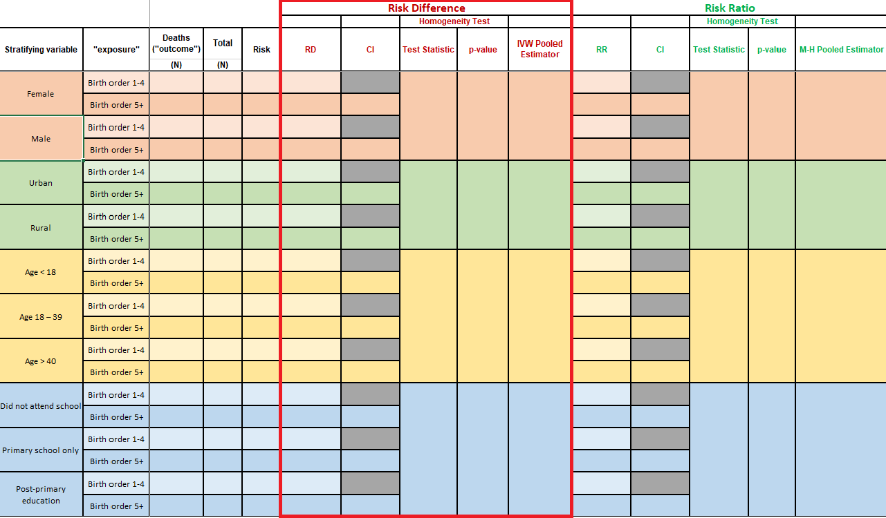

```{r setup, include=FALSE}
knitr::opts_chunk$set(echo = FALSE)
library(knitr)
library(tidyverse)
library(xaringanExtra)
library(epiAssist)
library(epiR)
library(emo)
```

```{r xaringanExtra-clipboard, echo=FALSE}
xaringanExtra::use_clipboard()
```

### LAB MATERIALS 

* [__R Markdown file for Lab 4__](assignments/lab4_705[assignment].Rmd)
Click link to download. Fill it in with your answers to the following lab tasks. When you're ready to submit, name it as `Lab4_FirstinitialYourlastname.Rmd`, and submit it using the Sakai dropbox.

* [__Excel document with Table for Task 2__](assignments/lab4_705_tables.xlsx)

* Lab_4_kenya.rds - data file available on Sakai

### Lab 4 Goals

* Calculate measures of association between birth order (i.e. the primary exposure of interest) and child mortality by 5 years (i.e. the primary outcome of interest) within strata of other variables

* Assess for potential confounding, mediation or effect measure modification

### Lab 4 Grading scheme

| Competency | Points |
|:-----------|:------:|
|   .Rmd file runs without error |   10  |
|   Table 1 - Frequency counts and Risk  |   20  |
|   Table 1 - Risk difference  |   20   |
|   Table 1 - Risk ratio  |   20  |
|   Task 3 (short answer) |   15  |
|   Task 4 (short answer) |   15  |
|   __Total__  |  __100__  |


## Task 1: Load libraries & data

__For this assignment, use the dataset 'Lab_4_kenya.rds'.__

This lab will also require the packages {tidyverse}, {fmsb}, {epiR}, and {epiAssist}

You may need to install {fmsb}. You can do so with the following code:

```{r eval = FALSE, echo = TRUE}
install.packages("fmsb")
```


Hopefully at this point in the semester, you have a pretty good grasp on how to load libraries and data. But if you're still unsure about something:

[Help loading libraries](https://dghi-biostat.github.io/biostatlab/docs/705_lab_0.html#load-libraries).
 [Help loading data](https://dghi-biostat.github.io/biostatlab/docs/705_lab_0.html#task-4-load-data).

## Task 2: Table 1

__INSTRUCTIONS:__ Generate frequency counts of 5-year mortality (`death`) according to child's birth order (`bord5`), stratified by the following variables:

* `male`
* `rural`
* `magec`
* `education`

Use Table 1 to record frequency counts and strata-specific risk of death before 60 months, by birth order. Then, use `epi.2by2()` to generate stratified measures of risk difference, risk ratios, and their accompanying confidence intervals. 

You will also use the resulting `epi.2by2()` object to extract test statistics and p-values that test for potential effect measure modification by the stratifying variables. 

Moreover, you will use a pooled (i.e. adjusted) estimate of risk difference and risk ratio to assess for confounding by comparing those estimates to the crude (i.e. unadjusted) estimates of risk difference and risk ratio."

Below is a detailed guide on how to complete each step of these instructions.

### Tabular analysis of stratifying variables

Table 1 is an example of a stratified analysis of exposure and outcome variables. Essentially, we want to know if the four variables (`male`, `rural`, `magec`, and `education`) are confounders and/or effect measure modifiers of the relation between birth order and 5-year infant mortality. In other words, Questions of effect measure modification include whether the degree of association of child's birth order and mortality status is different for boys and girls? What about for rural and urban families? Mothers of different age categories? And so on...

<aside>Remember the [BIG PICTURE](https://dghi-biostat.github.io/biostatlab/docs/705_lab_3.html#task-2-big-picture) that was explained in the previous lab </aside>

When you open the Excel file that contains __Table 1__, here is what you will see:


<aside>If you haven't already, download the Excel file [at the top of this page](https://dghi-biostat.github.io/biostatlab/docs/705_lab_4.html#lab-materials) to access __Table 1__ </aside>

We will break __Table 1__ into sections, and walk you through how to obtain these values in R.

### Task 2.1: Stratified frequency counts and risk

__INSTRUCTIONS:__ Fill in the table with the numbers of deaths (`death`, the outcome) and the 60-month risk of death according to birth order (`bord5`, the exposure), stratified by:

  a)	Child’s gender (variable `male`)  
  b)	Rural/urban residence (variable `rural`)  
  c)	Maternal age (variable `magec`)  
  d)	Maternal education (variable `education`)  


  
For this task, we recommend that you create a table object with `table()`, similar to [the one you created in lab 3](https://dghi-biostat.github.io/biostatlab/docs/705_lab_3.html#step-1-create-a-table-object-with-table), where your outcome of interest is mortality (`death`) and your exposure of interest is child birth order (`bord5`). Except this time, include a third stratifying variable.

<aside> If you've been enjoying the {tidyverse}, feel free to use `group_by()` and `count()`. But the table object will be useful in later steps.</aside>

`table()` allows for an unlimited number of stratifying levels. You keep listing variables, and `table()` will keep splitting the data into subsets. 

Say that we created a binary variable in our `kenya` dataset that indicated whether or not a mother's BMI was above or below 25 kg/m^2^. Let's call that variable `mbmi_25`. Here is an example of a set of contingency tables of `bord5` and `death`, stratified by `mbmi_25`:


```{r echo = TRUE, eval = FALSE}
mbmi_tab <- table(kenya$bord5, kenya$death, kenya$mbmi_25)

mbmi_tab

#> , ,  = <25
#> 
#>                     
#>                      Alive Dead
#>   1-4 in Birth Order  7931 1071
#>   5+ in Birth Order   2180  409
#> 
#> , ,  = >=25
#> 
#>                     
#>                      Alive Dead
#>   1-4 in Birth Order  3700  374
#>   5+ in Birth Order    773  146
```

Here, our stratifying variable is `mbmi_25`, which separates our tabulated data into two tables according to mothers who have a BMI greater than or equal to 25, and those with BMI less than 25.

We can generate row-wise proportions of our table by wrapping the table object in the `proportions()` function.

<aside> row-wise proportions, a.k.a. __RISK of DEATH/NOT DEATH!__ As a reminder, rates (time in the denominator) are preferable measures of incidence of death when there are missing outcomes.</aside>

```{r echo = TRUE, eval = FALSE}

proportions(mbmi_tab, margin = c(1, 3))


#> , ,  = <25
#> 
#>                     
#>                           Alive       Dead
#>   1-4 in Birth Order 0.88102644 0.11897356
#>   5+ in Birth Order  0.84202395 0.15797605
#> 
#> , ,  = >=25
#> 
#>                     
#>                           Alive       Dead
#>   1-4 in Birth Order 0.90819833 0.09180167
#>   5+ in Birth Order  0.84113166 0.15886834
```

<aside> The argument `margin = ` designates along which we'd like to split our table when deriving proportions. By putting `margin = c(1,3)`, we restrict our calculation of proportions to row (`1`) and strata (`3`). Notice how each row sums to 1. Try playing with this configuration to see how it works.</aside>


### Task 2.2: Create `epi.2by2()` object

__INSTRUCTIONS:__ Create an `epi.2by2()` object for each of the tables you generated above. 

`epi.2by2()` works just like `mAssoc()`. We need to [rearrange our tables](https://dghi-biostat.github.io/biostatlab/docs/705_lab_3.html#step-2-rearrange-table-with-fliptable) so that our outcome of interest and exposure of interest are in the top-left corner of each table. 

Good news: The function `flipTable()` is designed to work with stratified tables too!

Do the following:

  __a.__  `flipTable()` so that the cell that contains the index level of the exposure (birth order) and the outcome of interest (mortality status) is in the top-left corner of either table. 
  
For instance:
  
```{r echo = TRUE, eval = FALSE}
mbmi_flip <- flipTable(mbmi_tab)
```

  __b.__  Create an `epi.2by2()` object by using the `flipTable()` object, with confidence level of 0.95 and `units` set to `1`.
  
```{r echo = TRUE, eval = FALSE}
mbmi_epi <- epi.2by2(mbmi_flip, units = 1, conf.level = 0.95)
```

<aside>We set `units = 1` to obtain risk difference as a proportion. The default unit of `100` would give us measures of risk "per 100 persons". </aside>


### Task 2.3: Extract estimates of risk difference

__INSTRUCTIONS:__ Use the `epi.2by2()` object to extract the measure of risk difference for mortality in association with `bord5` *within* each covariable stratum, along with test statistics and an overall ("adjusted") pooled estimate of risk difference. 



__IMPORTANT:__ The output for `epi.2by()` is NOT the full extent of the information contained within an `epi.2by2()` object! There is more to every object than what meets the eye.

<aside> 

```{r fig.cap = "More than eye", out.width="30%"}
knitr::include_graphics("images/more_eye.png")
```

</aside>

When you call an `epi.2by2()` object, you will notice that its printed output is a lot like that of `mAssoc()` from the previous lab. Except this time, there are "crude" and "M-H" estimates:


<aside>This output is what's called the object's ["print method"](https://riptutorial.com/r/example/1221/printing-and-displaying-strings)</aside>

But if you inspect the `epi.2by2()` object (either in your R Environment, or by typing the object's name, followed by `$`), you will find vectors, lists, data frames, and all sorts of sub-objects.

<aside> See [this link](https://dghi-biostat.github.io/biostatlab/docs/help_jargon.html#section) if you are still uncertain about the functionality of `$`</aside>

Following is how to locate the necessary information for this portion of __Table 1__

#### a. Risk difference and 95% CI

To access the risk differences of individual strata, use the following path to refer to that exact component of your `epi.2by2` object:

```{r eval = FALSE, echo = TRUE}

object$massoc.detail$ARisk.strata.wald

```

<aside> Confused by the nomenclature? `massoc` is Measures of Association. `ARisk` is Attributable Risk. `strata` refers to strata-specific measures. `wald`..... ask Larry or Liz. </aside> 

So to obtain our measures of risk difference within separate stratum of mothers with BMI < 25 and mothers with BMI >= 25, we can use the following code:

```{r eval = FALSE, echo = TRUE}
mbmi_epi$massoc.detail$ARisk.strata.wald

#>          est      lower      upper
#> 1 0.03900249 0.02344295 0.05456203
#> 2 0.06706667 0.04182403 0.09230931
```

You might notice that this returns a single estimate for each stratum. Our table, however, asks for two estimates for each. What gives??

Since we have pre-determined our "reference" and "index" levels, and know that a risk difference is [defined](https://dghi-biostat.github.io/biostatlab/docs/705_lab_2.html#reference-and-index-levels-of-a-categorical-variable) as "risk in the level of interest minus risk in the reference level", what's the result when our reference level is also our level of interest? 

#### Check your work!

To check which value belongs to which strata, you can calculate it by hand using the values for risk that you obtained in Task 2.1.

You can also use the function `riskdifference()` from package {fmsb} to quickly derive risk ratios and confidence intervals.

To learn how to use this function, you can view its documentation by running the following code in your console:

```{r echo = TRUE, eval = FALSE}
?riskdifference
```

<aside>This function is pretty straightforward and I'm confident you can hack it `r emo::ji("fox")`  </aside>


#### b. Test of homogeneity and p-value


Inconveniently, `epi.2by2()` doesn't actually provide a chi-squared test of homogeneity of stratified risk differences. We can obtain this estimate by using the function `epiHomog()`, which takes a `flipTable()` object as its primary argument.

If your `flipTable()` objects are properly oriented, they should suffice. Use your `flipTable()` objects as an argument in the function `epiHomog()` to return the test statistic and p-value for a test of homogeneity at a significance level of 0.05:

```{r eval = FALSE, echo = TRUE}

epiHomog(aFlippedTable)

```

Using our `flipTable()` object that is stratified by mother's BMI, we would run the following code to obtain the resulting output:

```{r eval = FALSE, echo = TRUE}
epiHomog(mbmi_flip)

#>   A tibble: 1 x 2
#>    `Test statistic` `p-value`
#>              <dbl>     <dbl>
#>   1           3.44    0.0637
```

##### Interpreting X2 test of homogeneity

What exactly is the chi-square test of homogeneity for? Well, it's all about effect measure modification. Suppose we focus on the risk difference measure. We use the risk difference measure to quantify the association of birth order with the risk of death by 60 months of age. In particular, we use it to quantify the risk of death for those with birth order 5+ in comparison to the risk of death for those with birth order 1-4 (i.e. the reference level) by subtracting the two risks. 

When we consider a third variable such as male,  the chi-square test of homogeneity is used to evaluate whether there is evidence that the risk difference is different for male and for female children. If so, it is important that we report the risk difference separately for male and for female children. In an interesting feature, if there is effect measure modification on one effect measure scale (e.g. risk difference), then it may very well not be present on another scale (e.g. risk ratio). This is precisely why we talk about "effect *__measure__* modification" and not simply "effect modification".


#### c. Pooled estimate (Mantel-Haenszel)
  
Finally, we want the pooled estimate of risk difference. You might have already found this in the original print method's output of our `epi.2by2()` object, where it's referred to as `Attrib risk in the exposed (M-H)`.

But since we need to report this estimate to three decimal points (see gutter), we need to reach into our `epi.2by2` object and find the exact Mantel-Haenszel pooled estimate. You can access it by calling the following path:

<aside>As per [lab submission guidelines](https://dghi-biostat.github.io/biostatlab/docs/submit.html#rounding) on rounding </aside>

```{r eval = FALSE, echo = TRUE}

object$massoc.detail$ARisk.mh.wald

```

<aside>Here, `mh` stands for "Mantel-Haenszel"</aside>

Using our `epi.2by2()` object from before, `mbmi_epi`, we find this value and its resulting output as follows:

```{r eval = FALSE, echo = TRUE}

mbmi_epi$massoc.detail$ARisk.mh.wald

#>          est      lower      upper
#> 1 0.04662555 0.02684395 0.06640716
```

We would interpret this pooled result by saying that, when accounting for confounding in the exposure due to a third variable (`mbmi_25`), risk of the outcome in the exposed was 0.05 (95% CI 0.03 to 0.07) higher than the unexposed.


### Task 2.4: Extract estimates of risk ratios

The process for obtaining risk ratios, test statistics for homogeneity between strata, and pooled estimates is very similar to that of obtaining risk differences. Except this time, we don't need a separate function for finding the test of homogeneity -- `epi.2by2()` generates the test statistic for homogeneity of risk ratios itself.


#### Risk ratios

To extract risk ratios from an `epi.2by2()` object, you can use the following path:

```{r eval = FALSE, echo = TRUE}

object$massoc.detail$RR.strata.wald

```

Again, when you're finding these risk ratios, consider what we're asking for in the table when we request the risk ratio of the reference level as it pertains to the reference level. What does it amount to when we take the ratio of something to itself?

```{r fig.cap = "[Tautology club](https://www.explainxkcd.com/wiki/index.php/703:_Honor_Societies)"}
knitr::include_graphics('https://imgs.xkcd.com/comics/honor_societies.png')
```


Okay moving on...so our `mbmi_epi` object renders the following output:

```{r eval = FALSE, echo = TRUE}
mbmi_epi$massoc.detail$RR.strata.wald

#>        est    lower    upper
#> 1 1.046320 1.027315 1.065676
#> 2 1.079734 1.048089 1.112334
```

#### Check your work!

To check which value belongs to which strata, you can calculate it by hand using the values for risk that you obtained in Task 2.1.

You can also use the function `riskratio()` from package {fmsb} to quickly derive risk ratios and confidence intervals.

To learn how to use this function, you can view its documentation by running the following code in your console:

```{r echo = TRUE, eval = FALSE}
?riskratio
```

<aside>
This one works the same as `riskdifference()`. Look it up and give it a try!

</aside>


#### Test of homogeneity and p value

The test of homogeneity for risk ratios is available in the following location within our `epi.2by2()` object

```{r eval = FALSE, echo = TRUE}

object$massoc.detail$wRR.homog

```

Performing this on our `mbmi_epi` object yields the following result:

```{r eval = FALSE, echo = TRUE}
mbmi_epi$massoc.detail$wRR.homog

#>   test.statistic df   p.value
#> 1       3.109451  1 0.0778392
```

Reflecting on this test statistic and the resulting p-value, given a significance level of 0.05, would we conclude that mother's BMI is a confounder in assessing the influence of birth order on the 5 year risk of mortality of children in our study cohort?

Hover for answer:
<span class="spoiler2"> YOU THINK YOU GET FREEBIES?? </span>

#### Pooled estimate (Mantel-Haenszel)

The pooled estimate appears in the printed output when you call your `epi.2by2()` object from the environment, and is called `Inc risk ratio (M-H)`. However, this is only reported to two decimals. To access the actual value instead of the rounded one, you can look for it in the following place within your `epi.2by2()` object:

```{r eval = FALSE, echo = TRUE}

object$massoc.detail$RR.mh.wald

```

Using our `mbmi_epi` object renders the following output:

```{r eval = FALSE, echo = TRUE}

mbmi_epi$massoc.detail$RR.mh.wald

#>        est    lower    upper
#> 1 1.055389 1.039048 1.071988
```

We would interpret this as meaning that when we account for confounding due to mother's BMI, the risk of experiencing the outcome among the exposed was 1.06 (95% CI 1.04 to 1.07) times greater than the outcome of experiencing risk among the unexposed.


## Task 3: Short Answer

__PROMPT:__ Do you see evidence for confounding for any of the stratification variables (`male`, `rural`, `magec`, and `education`)?  Explain your response for each variable.  

(Hint, you will need to refer back to the crude association estimates of risk difference and risk ratio that you generated for Table 3 of Lab 3).

## Task 4: Short Answer

__PROMPT:__ For which covariables does it seem appropriate to report a single pooled adjusted estimate and for which does it seem necessary to report separate stratified estimates (i.e., do you see evidence of effect modification)?  Explain your rationale for each covariable.  

Does your answer differ depending on whether you are considering the risk difference or risk ratio as your measure of effect?

