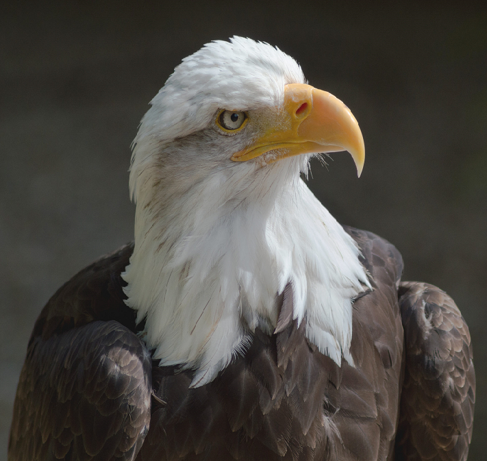
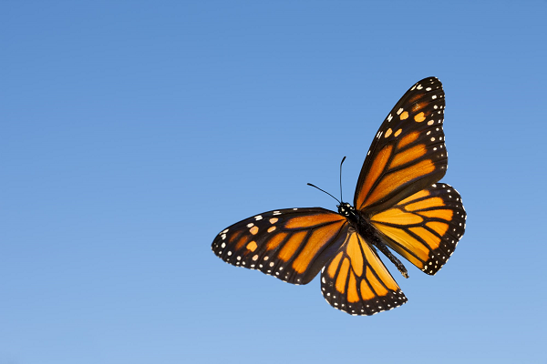
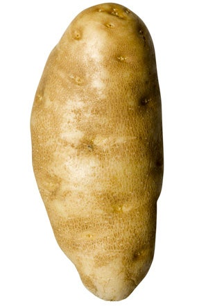
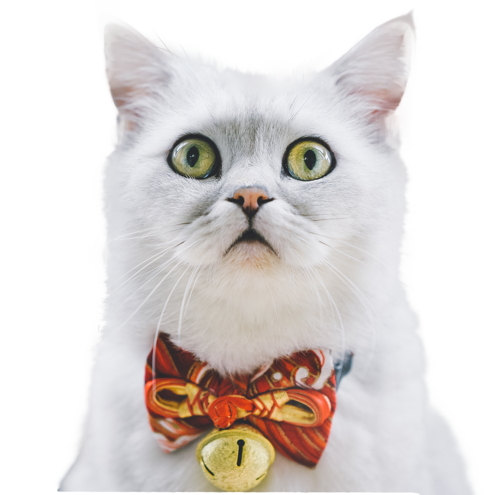

```{r setup, include=FALSE}
knitr::opts_chunk$set(echo = FALSE)
```


### Larry

```{r fig.link = 'https://chirpforbirds.com/wild-bird-resources/celebrate-independence-with-americas-bird-the-bald-eagle/', out.extra="class=external"}

```

Larry has been growing out his hair.


### Nour

```{r out.width = '60%', fig.link = 'https://www.southernliving.com/news/monarch-butterfly-migration-texas-2019', out.extra="class=external"}

```

Nour, in cosplay as a butterfly. Pretty spot on, eh?

OH: Thursday, 9am - 10am

### Nathan

```{r out.extra="class=external"}

```

Nathan is a professional potato.

OH: Tuesday, <a href = "">1</a>2:30am - <a href = "">1</a>:30pm

### The Catscot

```{r out.width = '45%'}

```

Our little mascot in the upper-left hand corner was Designed courtesy of 699pic at [pngtree.com](https://pngtree.com/freepng/cute-cat_5644947.html?sol=downref&id=bef)