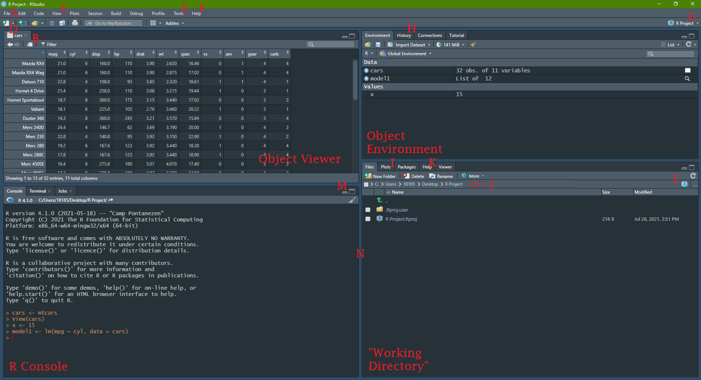
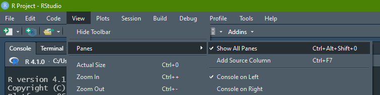
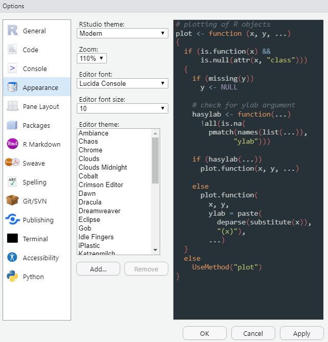

```{r setup, include=FALSE}
knitr::opts_chunk$set(echo = FALSE)
library(knitr)
```

## RStudio Basics

### The R Environment

```{r}

```

<aside>
**A:** File (New project, New file > R Markdown)  
**B:** Pop-out window (also works in R Markdown)  
**C:** Manage window panes  
**D:** New file  
**E:** Find packages, check for updates, manage environment options  
**F:** Find cheatsheets (dplyr, ggplot2, R Markdown)  
**G:** Current R Project  
**H:** Console history  
**I:** Plot viewer  
**J:** File path  
**K:** Browse help documentation  
**L:** Click to return to working directory home  
**M:** Click to expand or shrink window pane or...  
**N:** Drag to manage window size
</aside>

### Managing window panes

Did you lose track of one of your window panes? Use the *View* tab in the top bar to return to a view with all panes



### Change RStudio color theme

Is the white RStudio background burning your retnas? Need a change of scenery? No need to go outside! 

In the top bar, go to *Tools > Global Options*, and then select "Appearance":



### RMarkdown keyboard shortcuts

You can find me mashing the following keys in __Windows__:

|     Shortcut     |    Keys (Windows)    |   Keys (MacOS)    |
|:----------------:|:--------------------:|:-----------------:|
| Run a line of code | (With typing cursor on line) *ctrl + enter* |  (With typing cursor on line) *cmd + enter* |
| Run a chunk of code | (With typing cursor in chunk) *ctrl + shift + enter* |(With typing cursor in chunk) *cmd + shift + enter* |
| Create a new chunk | *ctrl + alt + i* | *cmd + option + i* |
| Type a pipe | *ctrl + shift + m* | *cmd + shift + m* |
| Type an assignment operator | *alt + -* | *option + -* |
| Stop running | (In Console) *esc* | (In Console) *esc* |

### Session information and help documentation

If for some reason your code is hitting an error, here are some useful commands you might run in your RStudio Console to help troubleshoot:

#### Function Documentation

__Command:__ `?functionName`

__What it does:__ Pulls up the documentation for whatever you type in place of `functionName`, and displays it in the Help window. A function's documentation is often (but not always) the final word on how a function is meant to behave in R. It will provide information on the [function's arguments](https://dghi-biostat.github.io/biostatlab/docs/help_packages.html#objects-functions-and-arguments) (and their default values), the resulting output ("Values"), and will give you examples of how to implement that function. 

#### Session information

__Command:__ `sessionInfo()`

__What it does:__ If you're experiencing issues with a certain package, maybe it's time for an update. You can check your current version of R using this command. Find information on specific packages by using the argument 'package = packageName'. 

You can also find which version of RStudio you have by running `RStudio.Version()`

#### View Traceback

__Command:__ `traceback()`

__What it does:__ If your code keeps hanging up on an error, you can often find clues as to why it's happening by viewing the underlying code that's causing your code to halt. Traceback will print the list of functions that were called before the error occurred. It's literally "tracing your steps" right before the error happened. The language itself in the traceback is usually pretty cryptic and hard to read at first. Don't let that stop you from looking at it when you encounter problems. 

#### Memory storage information

__Command:__ `object_size()`

__What it does:__ For the purposes of this lab, you most likely won't need to worry about your computer's RAM. Nevertheless, the nerds among us might find it interesting to inspect the size of an object that we've saved to our R Environment. Use `object_size(objectName)` to inspect a given object. Alternatively, inspect overall RAM usage and limitations with `memory.size()` and `memory.limit()`. 

## Extended resource guide to RStudio

R Studio will be the launching pad for all of our lab assignments in this course. 

The RStudio environment itself can feel overwhelming at first. Luckily, there are excellent resources already available to help get you acquainted:

* For those of you who prefer to learn by reading, [__this website's first tutorial__](https://aosmith.shinyapps.io/part1_rbasics_getting_started/#section-introduction), "Getting started with R/RStudio", is a good place to start.

* Dr. Eric Green used to run a summer workshop called "I Eat Data Science for Breakfast". He gives a stellar tutorial to the RStudio environment [__starting at 10:49 in his Week 1 video__](https://youtu.be/fntu_jMsWWE?t=649).

<aside>
```{r, fig.cap = "I Eat Data Science for Breakfast"}
include_graphics('../images/ieat_covid.png')
```
</aside>

* If you were checking your email at all over the summer, you may also already be familiar with Duke Librarian, John Little, and his series called RFun. Feel free to review [__his video introducing the RStudio environment__](https://www.youtube.com/watch?v=Wmozk2qEsL0&t=38s)

<aside>
```{r, out.width = "90%", fig.cap = "[RFun with John Little](https://rfun.library.duke.edu/)"}

```
</aside>


