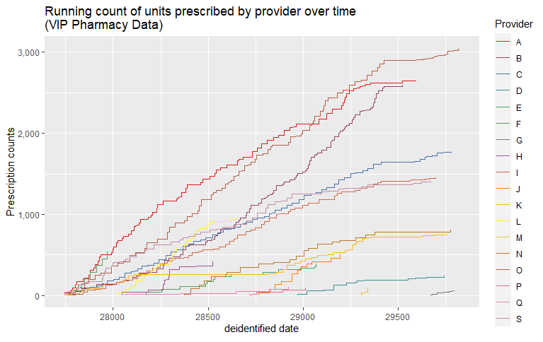

class: center, middle

# Review

## `⚔`

```{r setup, include=FALSE, warning = FALSE}
options(htmltools.dir.version = FALSE)
library(tidyverse)
library(knitr)
library(xaringanthemer)
library(xaringanExtra)
style_solarized_light()
#style_duo(primary_color = "#1F4257", secondary_color = "#F97B64")
#style_duo_accent(primary_color = "#035AA6", secondary_color = "#03A696")
```

---
# Review

Here are some concepts that we introduced in the previous lab session:

--

- Creating a new project & R Markdown file

--

- Using basic functions

--

- Data types

--

- Vectors

--

- Refer to individual variables within a data frame with `$`

---

# Today's agenda:

--

- Review:

  - Data types
  - Vectors
  
--

- Create our own toy __vectors__, and assemble them into a __data frame__

--

- Transform our data frame by adding new columns with `mutate()`

--

- Learn more about `%>%` (pipes!)

--

- Learn the basic anatomy of functions

--

- Learn the basics of plotting in {ggplot}

---
# Data types in R

--

Two main types of data: numbers & non-numbers

--

.pull-left[
__Numeric__
1. Integers (eg. 1, 2, 3);

1. Double/floating point (eg. 1.2345235, 600.342, 235.9596);

1. Dates (in this lab, we deal with time, but not "Dates")
]

--

.pull-right[
__non-Numeric__

1. character strings (e.g. "text!");

1. factors (i.e. categorical variables)

1. logical (i.e. TRUE, FALSE)

]

--

## `NA` can be used with any of these data types to represent:

--


Data that is __*"Not available"*__

---
class: inverse

# Vectors

- A vector is a "data structure that contains data elements of the same __*type*__"

--

- __Translation:__ It's literally just a list of things that are alike

--

- Create your own vector with `c()`, and separate each value with a comma

--

- A logical vector of length 6: 

```{r}
logic <- c(TRUE, FALSE, TRUE, TRUE, FALSE, FALSE)
```

--

- A character vector of length 6:

```{r}
string <- c("This", "is", "a", "vector", "of", "character strings")
```

--

- A numeric vector of length 6:

```{r}
numeric <- c(24, 12.2, 55, 23, 4.01, 3.33)
```


---

# Data frames & tibbles

- In the tidyverse, "tibble" is basically just another word for "data frame"

--

- Like a spreadsheet, data frames contain: Columns (variables) & Rows (observations)
  
--

- A data frame is just a "list" of vectors of all the same length!

--

```{r eval = FALSE}
trees <- tibble(logic, string, numeric)
```

--

```{r echo = FALSE}
trees <- tibble(logic, string, numeric)

kable(trees)
```

---
## Vectors -> data frame

```{r}
diseased <- c(TRUE, FALSE, TRUE, TRUE, FALSE, FALSE)
```

```{r}
location <- c("hilltop", "glade", "marsh", "ravine", "glade", "hilltop")
```

```{r}
treeHeight <- c(24, 12.2, 55, 23, 4.01, 3.33)
```

--

```{r}
trees <- tibble(diseased, location, treeHeight)
```

--

```{r echo = FALSE}
kable(trees)
```

---
## Inspecting data with functions

```{r echo = FALSE}
kable(trees)
```

```{r}
nrow(trees) # gives us the number of rows
```
```{r}
mean(trees$treeHeight) # gives us the mean of variable "treeHeight"
```
---
## Inspecting data with functions (cont.)

```{r echo = FALSE}
kable(trees)
```

```{r}
max(trees$treeHeight) # gives us the maximum value of "treeHeight"
```

```{r}
unique(trees$location) # lists unique values within variable "location"
```

---
## Transforming data with functions
```{r xaringan-panelset, echo = FALSE}
xaringanExtra::use_panelset()
```
- In the tidyverse, we use a pipe to "funnel" our data to a series of functions

- We can use `mutate()` to create a new column


.panelset[
.panel[.panel-name[Before mutate()]

```{r echo = FALSE}
kable(tibble(diseased, location, treeHeight))
```

```{r}
trees <- trees %>%
  mutate(newColumn = treeHeight / 2)
```

]

.panel[.panel-name[After mutate()]

```{r eval = FALSE}
trees <- trees %>%
  mutate(newColumn = treeHeight / 2)
```

```{r echo = FALSE}
kable(trees)
```

]
]

---
class: inverse, center, middle

# Pipes! 
# `%>%`

---
# A piping example:

.panelset[

.panel[.panel-name[Code]

```{r eval = FALSE}
trxdata %>%
  filter(provider != 'refill') %>%
  group_by(provider) %>%
  arrange(trxdate) %>%
  mutate(cum_awp_provider = cumsum(x)) %>%
  ggplot() + 
  geom_line(aes(x = trxdate, y = cum_awp_prov1, color = provider)) +
  labs(title = "Running count of units prescribed by 
       provider over time\n(VIP Pharmacy Data)", 
       y = "Prescription counts", 
       x = "deidentified date", 
       color = 'Provider') +
  scale_y_continuous(labels = comma) +
  scale_color_manual(values = mycolors3(colorCount3))
```
]

.panel[.panel-name[Output]

```{r out.width = "80%", echo = FALSE}

```


]
]


---

## Using `case_when()` for conditional statements

```{r echo = FALSE}

kable(trees)

```

What will the following code do to `trees`?

```{r eval = FALSE}
trees <- trees %>%
  mutate(conditionalVar = case_when(treeHeight > 20 ~ 0,
                                    diseased == FALSE ~ 1,
                                    location == "hilltop" ~ 2))
```

---

# Using `case_when()` (cont.)

```{r}
trees <- trees %>%
  mutate(conditionalVar = case_when(treeHeight > 20 ~ 0,
                                    diseased == FALSE & treeHeight < 20 ~ 1,
                                    location == "hilltop" ~ 2))
```

```{r echo = FALSE}
kable(trees)
```

--

Notice that `location == "hilltop" ~ 2` never gets evaluated. Why?

---

# The anatomy of a function

```{r echo = FALSE}
kable(trees)
```

--

```{r eval = FALSE}

factor(trees$conditionalVar, 
       labels = c(">20", "not diseased"))

```

--

The underlying anatomy:

```{r eval = FALSE}
function(argument1Value, # R naturally recognizes some arguments
         argument2 = argument2Value) # others we can specify with =
```

---
# Creating categorical variables with `factor()`

```{r}
trees$conditionalVar <- factor(trees$conditionalVar,
                                   labels = c(">20", "not diseased"))
```

--

```{r echo = FALSE}
kable(trees)
```

---

## Plotting `trees` with `ggplot()`

In `ggplot`, every plot is built on an initial "plotting field" with universal aesthetics and data:

--

```{r eval = FALSE}
ggplot(trees, aes(x = treeHeight))
```


--

```{r echo = FALSE, fig.height = 3}
ggplot(trees, aes(x = treeHeight))
```

--

.footnote[
__Note:__ "Aesthetics", or `aes()`, is just the way ggplot refers to variables. In the above plot, we have assigned the variable `treeHeight` to the "x aesthetic (the x-axis)
]

---
# Making a histogram with `geom_histogram()`

We can then "add layers" according variable type and our desired type of plot:

```{r eval = FALSE}
ggplot(trees, aes(x = treeHeight)) +
  geom_histogram()
```

--

```{r fig.height = 3, message = FALSE, warning = FALSE, echo = FALSE}
ggplot(trees, aes(x = treeHeight)) +
  geom_histogram()
```

--

.footnote[
Not a very effective use of a histogram when we only have 6 rows in our dataset, eh?
]

---
## Making a boxplot with `geom_boxplot()`

Changing the type of plot is pretty simple. Switch out `geom_histogram()` for `geom_boxplot()`. Since `treeHeight` is a numeric type variable, `ggplot` can create a boxplot using the same aesthetics:

```{r fig.height = 3}
ggplot(trees, aes(x = treeHeight)) +
  geom_boxplot()
```

---
# Making a scatter plot with `geom_point()`

We may decided to plot the variable named `treeHeight` against our other numeric type variable, `newColumn`. We can do this by mapping `newColumn` to the y-axis, and adding a `geom_point()` layer to our visualization.

--

What will this code create?

```{r eval = FALSE}
ggplot(trees, aes(x = treeHeight, y = newColumn)) +
  geom_point()
```


--

```{r fig.height = 3, echo = FALSE}
ggplot(trees, aes(x = treeHeight, y = newColumn)) +
  geom_point()
```

---
# Labelling a plot with `labs()`

Building on the scatter plot, perhaps we decide the plot needs labels to make it more easily interpreted. We can add a labels layer with `labs()`: 

```{r fig.height = 3}
ggplot(trees, aes(x = treeHeight, y = newColumn)) +
  geom_point() +
  labs(x = "Random numbers that Nathan typed as an example", 
       y = "Random numbers / 2", 
       title = "Plot of some random numbers")
```

---
# Plotting categorical variables with `geom_bar()`

Bar plots are a quick and easy way to plot frequency counts of categorical variables. We can plot our variable, `conditionalVar`, with a bar plot layer, `geom_bar()`. We can even change the color of the bars by giving it the argument `fill = `

```{r eval = FALSE}
ggplot(trees, aes(x = conditionalVar)) +
  geom_bar(fill = "forestgreen")
```

.pull-left[

```{r fig.height = 3, echo = FALSE}
ggplot(trees, aes(x = conditionalVar)) +
  geom_bar(fill = "forestgreen")
```

]

.pull-right[
- Find all kinds of different color options [here](http://www.stat.columbia.edu/~tzheng/files/Rcolor.pdf)

- Or use [hexadecimal codes](https://www.colorhexa.com/) to refer to specific colors (ex. [#12BBAC](https://www.colorhexa.com/12bbac))
]

---
class: center, middle, inverse

# Questions on Lab 0?