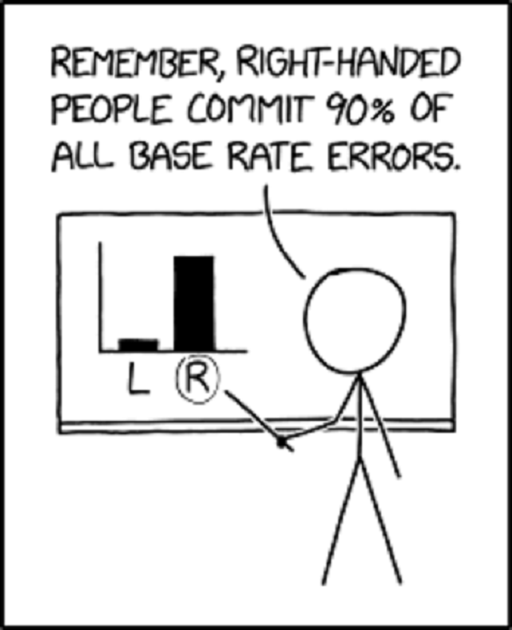

```{r setup, include=FALSE}
knitr::opts_chunk$set(echo = FALSE)

# Learn more about creating websites with Distill at:
# https://rstudio.github.io/distill/website.html

```

```{r fig.align = "center", echo = FALSE, fig.cap = "[xkcd.com - 'Base Rate'](https://www.explainxkcd.com/wiki/index.php/2476:_Base_Rate)"}


```


