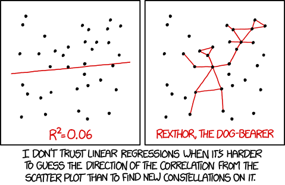

```{r setup, include=FALSE}
knitr::opts_chunk$set(echo = FALSE)

# Learn more about creating websites with Distill at:
# https://rstudio.github.io/distill/website.html

```

```{r fig.cap = "[Linear Regression](https://www.explainxkcd.com/wiki/index.php/1725:_Linear_Regression)", out.width = "20%"}

```


