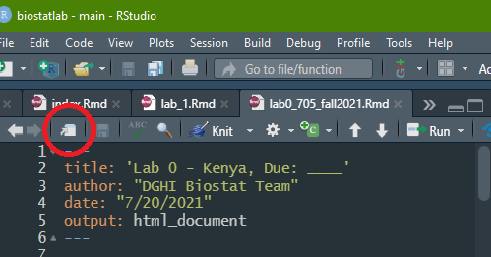

```{r setup, include=FALSE}
knitr::opts_chunk$set(echo = FALSE)

library(tweetrmd)
library(tidyverse)
library(skimr)
```

__*Note: This lab is not graded*__ (i.e. does not contribute to your course evaluation, so don't fret)

### LAB MATERIALS: 

* [R Markdown file for Lab 0.__](assignments/lab0_705_fall2021.Rmd)
Click link to download. Fill it in with your answers to the following lab tasks. Once you're finished, rename it as `firsInitial_YourLastName_Lab0.Rmd`, and submit it using the Sakai dropbox.

* Lab_0_kenya.rds - data file available on Sakai

### Lab 0 Goals:

By the end of this lab, you will have demonstrated a basic familiarity with the R coding environment and R Markdown files. You will be able to:

  * Start a new project and import data
  * Understand useful R terminology
  * Use summary statistics to describe the Kenya dataset
  * Create a categorical variable using a continuous one
  * Generate histograms and boxplots using ggplot2
  * Create a simple cross-tabulation of two variables
    

## Task 1: Establish a workflow

In R, we organize our work by projects. It is best practice to keep no more than one project in any single folder on your computer. First, we should establish the file folders from which we'll be working. 

## Create folders to store your work

If you haven't already, now would be a good time to: 

  1. Create a new folder on your computer called "705 Lab".
  2. Within that folder, create a folder for this lab, called "Lab 0".
  3. Finally, within that folder, create a folder for your data, called "data"
  4. Save the dataset titled Lab_0_kenya.rds (from Sakai) into the folder called "data"

__Please make this a habit. We will expect you to do this for every lab, as it will keep your work organized and will keep *you* happy.__

### Create a New Project in RStudio

Now open RStudio and take a deep breath. Don't panic. This will all be very familiar in a few short months. 

Initiate a new project by going to __*File*__ and clicking __*New Project*__. 

TODO: INSERT SCREENSHOT

Then select __*Existing Directory*__ and hit __*Browse*__. Navigate to the folder titled __Lab 0__. Open it, then hit __*Open*__. 

## Task 2: Familiarize yourself with R Markdown

Now, you will open a special kind of document known as "R Markdown". This is a text editor (like Word or Google Docs), but with a twist. You can run code *within the document*. This makes data analysis an interactive, iterative (and therefore fun?) process that usually looks like this:

  1. Write some code intended to transform your data
  2. Run the code
  3. Observe how your dataset behaved
  4. (Optional) Take a few notes
  5. Tweak code
  6. Repeat
  
For each lab, we will provide you with a skeleton Markdown file on Sakai. If you haven't already, download that file ("lab0_705_fall2021.Rmd") and save it to your folder called "Lab 0".

Now open the file in RStudio. You can just double-click on it from the file folder. It will appear, but might feel a little pinched. Luckily, RStudio allows Markdowns to pop-out. 

Click the white square at the top of the file that I've circled in the photo below to do just that:




## Task 3: Load packages and data

### Installing packages

Packages are collections of functions. As we'll see shortly, we use functions as code to view, manipulate, and analyze our data. 

There are packages that come built-in with R. These have names like {base}, {utils}, and {stats}.

Since R is open-source, users are able to create their own packages so that other R users can use them. These packages are available in places like [the Comprehensive R Archive Network (CRAN for short)](https://cran.r-project.org/web/packages/) and [GitHub](https://github.com/).

Lucky for us, packages are easily retrieved from the R Console. If you haven't already, run the following code from your console to download the packages that we'll be needing for this semester:


```{r install packages, eval = FALSE, echo = TRUE}
install.packages("tidyverse")
install.packages("skimr")
install.packages("epiR")
install.packages("devtools")
devtools::install_github("potato-nathan/epiAssist")
```


### Load libraries

To enable R to use a package's functions in our current project environment, we need to load the packages using the `library()` function.

In a fresh code chunk, call in the {tidyverse} and {skimr} packages using the following code:

```{r load libraries, eval = FALSE, echo = TRUE}
library(tidyverse)
library(skimr)
```

__Notice that when we install packages, we need to specify their names using quotes, but when we load them into R using `library()`, R recognizes them as package objects automatically, and so don't need quotes. You can surround them with quotes and it will load all the same.__


## Task 4: Load data

You will use the dataset Lab_0_kenya.rds for this lab. You've hopefully already saved this lab's dataset to the folder Lab 0 > data. You will use the function readRDS() to import the data file from your computer's folder. 

Since our project is located within the folder called "Lab 0", our computer will automatically look within that folder for the data.

All we need to do is specify that it's in the folder called "data". 

Use the following code to load your data into R and give it the name `kenya`. 

```{r load dataset, echo = TRUE, eval = FALSE}

kenya <- readRDS('data/Lab_0_kenya.rds')

```

The `<-` is called the __*Assignment Operator*__. We can use it to assign names to objects in our coding environment:

We can use our assignment operator for characters, numbers, logical operators, etc.:

```{r create var, echo = TRUE, eval = TRUE}
fruit <- c("oranges", "papayas", "apricots")

number <- 99

logical <- FALSE
```

Now that the above values are stored in our environment, we can use them in other functions or operations:

```{r operate var, echo = TRUE, eval = TRUE}
paste(fruit, "are orange", sep = " ")

number + 1

isTRUE(logical)
```

We've done the same thing with our dataset, giving it the name `kenya`. Use the function `head()` to view the first six rows in the dataset:

```{r head, echo = TRUE, eval = FALSE}

head(kenya)

```


## Task 5: Explore the dataframe

__Familiarize yourself with the data by using the commands `ncol()`, `nrow()`, `class()`, `names()` and `skim()`.__

  * __Are there any string/character variables?__
  * __Are there any variable or value labels?__ 
  * __Do any variables have notes?__ 

Similar to the function `head()`, we can feed our `kenya` data frame to various functions that tell us other useful information about it. 

Use `ncol()` to print the number of columns in our data frame

Use `nrow()` to print the number of rows

Use `class()` to view each variable's "type"

Use `names()` to view each variable's name.

Use `skim()` to print summary statistics for each variable in the data frame


## Task 6: Create variable mage

Using a pipe and the `mutate()` function, create a new variable, `mage` for mother’s age (as an integer) at the time of each child’s birth (note – some of these mothers have had multiple children). This is calculated from variables b3 (month code of child’s birth) and v011 (month code of mother’s birth). The difference between the values of these variables is months, so divide by 12 to get years. See the data dictionary for a more detailed description of month codes and how to use them. Use the `as.integer()` function within your `mutate()` operation to truncate the calculated values for mage to integers.

The `mutate()` function works with the following syntax.

```{r mutate, echo = TRUE, eval = FALSE}
# don't forget to write over your old dataframe with the new "mutated" one
data <- data %>%
  mutate(newVariableName = (Variable1 - Variable2))
```


## Task 7: Frequency distributions of mage

Suppose you want to break down `mage` into three categories. First, look at the frequency distribution (one-way frequency table) for `mage` to see where you might draw lines for your categories using the `table()` command. 

`table()` works by identifying unique values within a variable, and then counts them. 

It works on character variables, categorical (factor) variables, and even numbers.

We can tell R to look at specific variables inside our dataframe with the `$` sign. The syntax looks like this: `dataframeName$variableName`

We must also provide the argument `useNA = 'always'` to our `table()` function in order to include NA values in the tabulation.

Use `table()` to look at `mage`, then consider the following questions:

  * Are there any missing values for age? If so, how many?
  * Which range of ages appear the most frequently in mage?


## Task 8: Create variable magec

Using `mage`, generate a new variable with three categories: <18, 18-39, and ≥ 40, naming the new variable `magec` (__m__other’s __age__ __c__ategorical). Set the values for `magec` to be 0,1,2, where 0 corresponds to the youngest age group (<18).
Recommended steps:

* First, don't forget to use the assignment operator to save your changes to the `kenya` data frame.
* Then, use a pipe (%>%) and then `mutate()`  to create a new variable, magec, 
* within your `mutate()` command, use `case_when()` to create a series of conditional statements that assign numbers 0, 1, and 2 to each category 
* on a new line of code, use `factor()` to assign labels to each level of your new variable
*	Values: 
  + 0:  <18 
  + 1:	18-39
  + 2:  ≥ 40

Convert a variable to a factor with the following syntax:

```{r factor, echo = TRUE, eval = FALSE}
dataframe$variableYouWantToFactor <- factor(dataframe$variableYouWantToFactor,
                                            labels = c("Label for 0", "Label for 1", "Label for 2"))
```


## Task 9: Cross-tab of `mage` and `magec`

Look at a cross-tabulation (two-way table) of `mage` and `magec` to ensure that `magec` was created correctly. Be sure missing values were handled properly (all observations that have a missing value for `mage` should be assigned the R missing value “NA” for `magec`). Try the two separate methods for cross-tabulation, as we will be using both for separate purposes later in the semester:

### Method 1: 
Type “?table” in the console for help with how to create a 2x2 table.  Note: the order of the variables in the command controls which one is in the rows and which is in the columns. Experiment to make your table readable.

```{r 2x2table, eval = FALSE, echo = TRUE}
# example code:

table(data$x, data$y, useNA = 'always')

```

### Method 2: 
We can also use `tidyverse` functions to accomplish a two-way tabulation of our variables of interest. These functions will become increasingly relevant and useful, and are a big reason why R is such a popular platform for data science. We will use a pipe (`%>%`), `group_by()`, another pipe, and `count()` to get the same output given by `table()`.


```{r pipe, eval = FALSE, echo = TRUE}
# example code:

# notice that we don't want to assign this operation to a name
# we just want to view the output, hence the lack of "data <- "
data %>%
  group_by(x, y) %>%
  count()
```

A translation of the above code to written instructions would go as follows, where bolded words represent the grammatical equivalent of our pipe, `%>%`:

"Take dataset, `data`, __and then__ `group_by` by variable `x`, then within those groups, group by variable `y`, __and then__ `count` the values in each of our groups."

[Here's a link](https://cfss.uchicago.edu/notes/pipes/) to learning more about pipes. Or just take a look at this tweet:

```{r echo = FALSE}

tweet_screenshot(tweet_url("WeAreRLadies", '1172576445794803713?s=20'))

```


## Task 10: Save new dataset

Using function `saveRDS()`, save the new dataset in the same directory as our original data, using the following format: "firstInitial_YourLastName_lab0.rds"

`saveRDS()` takes two primary arguments:

  * The dataframe object you want to save
  * The location in which you'd like it saved as a .rds file
    
Don't forget the following:

  * The file locations should be in quotes, so that R knows to read it as a character string
  * Your file should be saved in your local Lab 0 folder, `data/`


