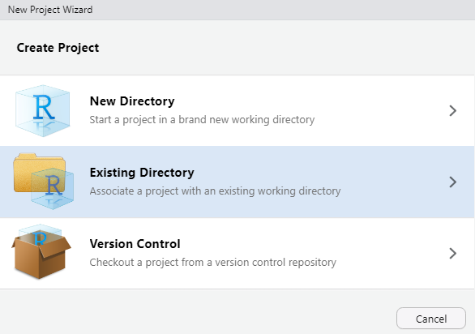

```{r setup, include=FALSE}
knitr::opts_chunk$set(echo = FALSE)

library(tweetrmd)
library(tidyverse)
library(skimr)

# devtools::install_github("gadenbuie/xaringanExtra")
library(xaringanExtra)
```

```{r xaringanExtra-clipboard, echo=FALSE}
xaringanExtra::use_clipboard()
```

```{r share-again, echo=FALSE}
xaringanExtra::use_share_again()
```

__*Note: This lab is not graded*__ (i.e. does not contribute to your course evaluation, so don't fret)

### LAB MATERIALS

* [__R Markdown file for Lab 0__](assignments/lab0_705_fall2021.Rmd)
Click link to download. Fill it in with your answers to the following lab tasks. Once you're finished, rename it as `Lab0_FirstinitialYourlastname.Rmd`, and submit it using the Sakai dropbox.

* Lab_0_kenya.rds - data file available in the Resources folder of the Sakai course webpage


### Slides

```{r embed-xaringan, echo=FALSE, fig.cap="[Slides](slides/index.html)"}
xaringanExtra::embed_xaringan(url = "files/Lab0_slides/Lab0_slides.html", ratio = "16:9")
```

### Lab 0 Goals

By the end of this lab, you will have demonstrated a basic familiarity with the R coding environment and R Markdown files. You will be able to:

  * Start a new project and import data
  * Understand useful R terminology
  * Use summary statistics to describe the Kenya dataset
  * Derive an ordinal categorical variable from a continuous one
  * Generate histograms and boxplots using ggplot2
  * Create a simple cross-tabulation of two variables
    

## Task 1: Establish a workflow

In R, we organize our work by projects. It is best practice to keep no more than one project in any single folder on your computer. First, we should establish the file folders from which we'll be working. __This should always be your first step when beginning an analysis.__

## Create folders (directories!) and projects to store your work

If you haven't already, now would be a good time to: 

  1. Create a new folder on your computer, calling it "705 Lab".
  2. Within that folder, create a folder for this lab, called "Lab 0".
  3. Finally, within that folder, create a folder for your data, called "data"
  4. Save the dataset titled `Lab_0_kenya.rds` (downloaded from Sakai) into the folder called "data"
  
<aside>The resulting file path for your data file should look like this: 

__"/705 Lab/Lab 0/data/Lab_0_kenya.rds"__ </aside>

__Please make this a habit. We will expect you to do this for every lab, as it will keep your work organized and will keep *you* happy.__

### Create a New Project in RStudio

Now open RStudio and take a deep breath. Don't panic. This will all be very familiar in a few short months. 

Initiate a new project by going to __*File*__ and clicking __*New Project*__. 


Then select __*Existing Directory*__ and hit __*Browse*__. Navigate to the folder titled __Lab 0__. Open it, then hit __*Open*__. 

If you've done this correctly, your new folder, "Lab 0" should appear in the bottom-right R Studio window pane, under the tab "Files" Likewise, the folder name, "Lab 0" should appear in the upper-right hand corner, indicating the current project's name. 

<aside>Current project indicator is marked as "G" in [this helpful screenshot](https://dghi-biostat.github.io/biostatlab/help_rstudio.html#the-r-environment) of the R Studio environment</aside>

## Task 2: Familiarize yourself with R Markdown

Now, you will open a special kind of document known as "R Markdown". This is a text editor (like Word or Google Docs), but with a twist. You can implement the instructions you have written in the R programming language directly *within the document*. That is, you can "run code" directly *within the document*. This makes data analysis an interactive, iterative (and therefore fun?) process that usually proceeds as follows:

<aside>[The word "run"](https://www.nytimes.com/2011/05/29/opinion/29winchester.html?_r=1) can have [*__so__* many meanings](https://english.stackexchange.com/a/80992). So exactly what do we mean when we say "run code"? 

It's a term meant to describe the process of allowing a computing program or software to *operate upon* something you've created in your computing environment. In R, you can "run code directly in the R console by typing your code and hitting *enter*. R Markdown can also run chunks of code, which we'll see in a moment.</aside>


  1. Write some code to generate new variables and perform statistical analysis
  2. Run the code
  3. Observe how your dataset behaved
  4. Take a few notes (for Science)
  5. Tweak code
  6. Repeat
  
For each lab, we will provide you with a skeleton Markdown file. If you haven't already, download that file ("lab0_705_fall2021.Rmd", available at the top of this page) and save it to your folder named "Lab 0".

Now open the file in RStudio. You can just double-click on it from the file folder. It will appear in the RStudio window pane, but might feel a little pinched. Luckily, RStudio allows Markdowns to pop-out. 

Click the white square at the top of the Lab 0 document (circled in red in the photo below) to do just that:


## Task 3: Install packages and load libraries

### Installing packages

Packages are collections of functions. As we'll see shortly, we use functions as code to inspect, manipulate, and analyze our data. They are the __verbs__ of the R language.

There are packages that come built-in with R. These have names like {base}, {utils}, and {stats}.

Since R is open-source, users are able to create their own packages so that other R users can use them. These packages are available in places like [the Comprehensive R Archive Network (CRAN for short)](https://cran.r-project.org/web/packages/) and [GitHub](https://github.com/).

Lucky for us, packages are easily retrieved from the R Console. If you haven't already, run the following code from the R Console, one line at a time, to download the packages that we'll be needing for this semester. Unless you uninstall R, __*you should only ever have to do this once__*:


```{r install packages 1, eval = FALSE, echo = TRUE}
install.packages("tidyverse")
```


```{r install packages 2, eval = FALSE, echo = TRUE}
install.packages("skimr")
```

```{r install packages 3, eval = FALSE, echo = TRUE}
install.packages("tableone")
```

```{r install packages 4, eval = FALSE, echo = TRUE}
install.packages("epiR")
```


```{r install packages 5, eval = FALSE, echo = TRUE}
install.packages("devtools")
```


```{r install packages 6, eval = FALSE, echo = TRUE}
devtools::install_github("potato-nathan/epiAssist")
```


### Load libraries

Unlike installing packages, every time we open a new R session, we need to enable a package's use in the R environment. To enable R to use a specific package and its functions, we can load them using the `library()` function.

In a fresh code chunk, call in the {tidyverse} and {skimr} packages using the following code:

```{r load libraries, eval = FALSE, echo = TRUE}
library(tidyverse)
library(skimr)
```

__Notice that when we install packages, we need to specify their names using quotes because the package name is not yet known to your own copy of RStudio. On the other hand, when we load them into the R environment using `library()`, R automatically recognizes them as the names of packages, so they don't require quotations.__


## Task 4: Load data

You will use the dataset `Lab_0_kenya.rds` for this lab. You've hopefully already saved it to the folder __Lab 0 > data__. You will use the function `readRDS()` to import the data file from your computer's folder. 

Since our *project* has been created within the __"Lab 0"__ folder, it is thus our "Working Directory", and RStudio will automatically start from that folder when we give it a function that asks it to look in our file directory.

Within our function, all we need to do is specify the file name, and that it's in the folder called __"data"__. 

Use the following code to load your data into R and give it the name `kenya`. 

```{r load dataset, echo = TRUE, eval = FALSE}

kenya <- readRDS('data/Lab_0_kenya.rds')

```

When we load our data into R, it becomes what, in R, is called a __*data frame*__, which is the R term used for a dataset object. Without going into too much detail, it's like having a spreadsheet of data with rows (i.e. different individual records) and columns (i.e. variables). For those of you familiar with mathematical terminology, it's like a matrix."

### Objects 

If functions are the verbs of the R language, objects are the nouns. Just like nouns, there are many different *types* of objects, which we will learn about throughout the semester. For now, you just need to understand that an object is anything in your R environment that is able to be explored, transformed, or analyzed by R functions. Objects also have unique names. In the code above, `kenya` is a data frame object. 

To further illustrate, in the chunk of code below, `fruit` becomes a character vector object of length 3, `number` becomes a numeric vector object of length 1, and `logical` becomes a logical vector object of length 1. 

You can use `class()` to inspect an object's type, and `object.size()` to inspect an object's size. We will learn more about [vectors](https://dghi-biostat.github.io/biostatlab/help_jargon.html#vector) in a later assignment.

Most functions require specific types of objects. 

### The assignment operator (`<-`)

The `<-` is called the __*Assignment Operator*__. We use it to assign names to objects in our coding environment:

We can use our assignment operator for characters, numbers, logical operators, etc.:

```{r create var, echo = TRUE, eval = TRUE}
fruit <- c("oranges", "papayas", "apricots")

number <- 99

logical <- FALSE
```

Now that the above values are stored in our environment, we can use them in other functions or operations as predefined variables:

```{r operate var, echo = TRUE, eval = FALSE}
paste(fruit, "are orange", sep = " ")
#> [1] "oranges are orange"  "papayas are orange"  "apricots are orange"

number + 1
#> [1] 100

isTRUE(logical)
#> [1] FALSE

```

We've done the same thing with our dataset, giving it the name `kenya`. We might use the function `head()` to view the first six rows in the dataset. This is a quick and easy way to glance at our dataset and its accompanying variables:

```{r head, echo = TRUE, eval = FALSE}

head(kenya)

```


## Task 5: Explore the data

__Familiarize yourself with the data by using the commands `ncol()`, `nrow()`, `class()`, `names()` and `skim()`.__

  * __Are there any string/character variables?__
  * __Are there any variable or value labels?__ 
  * __Do any variables have notes?__ 

Similar to `head()`, we can feed our `kenya` data frame to various functions that tell us other useful information about it. As a tip, you can use `$` in the format `[datasetName]$[variableName]` to refer to a specific variable/column within a dataset.

Use `ncol()` to print the number of columns in our data frame

Use `nrow()` to print the number of rows

Use `names()` to view each variable's name.

Use `class()` to view each variable's "type"

Use `skim()` to print summary statistics for each variable in the data frame


## Task 6: Create variable `mage`

Using a pipe (`%>%`) and the `mutate()` function, create a new variable, `mage` for mother’s age (as an integer) at the time of each child’s birth (note – some of these mothers have had multiple children). 

This is calculated from variables `b3` (month code of child’s birth) and `v011` (month code of mother’s birth). The difference between the values of these variables is in months, so __divide by 12 to get years__. See [the data dictionary](https://dghi-biostat.github.io/biostatlab/data_dict.html#century-month-code) for a more detailed description of month codes and how to use them. Use `as.integer()` around your calculation to truncate the calculated values for `mage` to integers.

<aside>Most datasets are accompanied by documentation or data dictionaries, which are a description of the variables in the data set and other relevant pieces of information. Be sure to read through [these guidelines](https://www.mc.vanderbilt.edu/crc/workshop_files/2012-09-07.pdf) if you haven't already.</aside>

For this task, the `mutate()` function will work with the following syntax. 

```{r mutate, echo = TRUE, eval = FALSE}
# don't forget to write over your old dataframe using `kenya <-`

data <- data %>%
  mutate(newVariableName = (oldVariable1 - oldVariable2))

```

### Pipes (`%>%`)

One of the most useful tools in the `tidyverse` package is a little thing called a [__*pipe*__](https://dghi-biostat.github.io/biostatlab/help_jargon.html#magrittrpipe). It's represented with the symbol `%>%`, and allows us to express a series of operations in a continuous string of code, rather than using the assignment operator over and over. 

As an example, let's pretend we have a dataset that is a record of birds struck by aircraft in the United Sates over the past few decades. We want to know the frequency distribution of sky conditions for birds struck over 5,000 feet within the borders of North Carolina. 

In base R, we might code it like this:

```{r eval = FALSE, echo = TRUE}
birds_NC <- subset(birds, state == "NC")

birds_NC <- subset(birds_NC, height > 5000)

table(birds_NC$sky)
```

With a pipe, `%>%`, both our code and output becomes more tidy. More importantly, it's easy to read:

```{r eval = FALSE, echo = TRUE}
birds %>%
  filter(state == "NC", height > 5000) %>%
  group_by(sky) %>%
  count()
```

The pipe can be interpeted as signifying __"and then"__. In the above example, the pipe tells the R console to take the dataset `birds`, __and then__ filter by `state` and `height`, __and then__ group by `sky`, __and then__ count the observations in each group.


## Task 7: Frequency distributions of `mage`

Suppose you want to break down `mage` into an ordinal categorical variable with three categories. First, we might inspect the frequency distribution (in one-way frequency table) for `mage`. Do this using `table()`. 

`table()` works by identifying unique values within a variable, and then counts their occurence. 

It works on character variables, categorical (factor) variables, and even numbers.

As was mentioned earlier, we can tell R to look at specific variables inside our dataframe with the `$` sign. The syntax looks like this: 

```{r eval = FALSE, echo = TRUE}
dataframeName$variableName
```

If we want to include a count of NA values in our table, we can also use the argument `useNA = 'always'` within `table()`.

Use `table()` to look at `kenya$mage`, then consider the following questions:

  * Are there any missing values for `mage`? If so, how many?
  * Which range of ages appear the most frequently in `mage`?


## Task 8: Create variable `magec`

Using `mage`, generate a new variable with three categories: "<18", "18-39", and "≥ 40", naming the new variable `magec` 

<aside>`magec` stands for: 
{m}other’s  
{age}   
{c}ategorical </aside> 

Set the values for `magec` to be 0,1,2, where 0 corresponds to the youngest age group (<18).

We recommend you do this in the following steps:

 1) Use a pipe (`%>%`) and then `mutate()`  to create a new variable, `magec`,  
 2) Within your `mutate()` command, use `case_when()` to create a series of conditional statements that assign numbers 0, 1, and 2 to each category  
 3) On a new line of code, use `factor()` to assign labels to each level of your new variable  
 4) Finally, once you get it to work, don't forget to use the assignment operator to save your changes to the `kenya` data frame. 

<aside>
Values:  
  0:  <18   
  1:	18-39  
  2:  ≥ 40  
</aside>

### `case_when()`

This function is used to create conditional rules when creating new variables with `mutate()`. It allows you to create a series of if-then (conditional) statements based on variables within your data. At first, the syntax for `case_when()` might strike you as a little overly complicated, especially for coding binary variables. But as your variables become more complex, `case_when()` really shines as a highly efficient way to create new variables on a series of complex conditions.

An example of the syntax is as follows:

```{r eval = FALSE, echo = TRUE}
case_when(size == 'small' ~ 0, 
          size == 'medium' ~ 1,
          size == 'large' ~ 2,
          TRUE ~ NA)
```

Here, the tildes represents a __formula__. To the left of the formula is a logical operation that can evaluate to either `TRUE` or `FALSE`

<aside> Click [here](https://www.statmethods.net/management/operators.html) for a list of logical operators available in the R language </aside>

To the right of the tilde, we put the value that we want to return __if the logical operation evaluates to `TRUE`__. If it is `FALSE` or `NULL`, `case_when()` behaves by moving on and testing the next conditional statement.

If it were run on a dataset containing a variable called `size`, the literal translation of the above code would go something like this:

```{r eval = FALSE, echo = TRUE}
For each row in the dataset,  
    * if `size` equals 'small', then return 0
    * if `size` equals 'medium', then return 1
    * if `size` equals 'large', then return 2
    * if `size` is any other real value, then return `NA`
```

<aside>This sort of literal translation of a programming language into readable English is what's known as ["pseudo-code"](https://xkcd.com/1185/)</aside>

When we do this within a `mutate()` function, the returned values get assigned to the new variable for each row of the dataset as they're evaluated.

The right side of the formula needs to always produce a value of the same variable __*type*__, but otherwise you have a high degree of freedom in what can be returned when the conditional statement is `TRUE`, including mathematical operations on other variables.

See the [documentation for `case_when()`](https://rdrr.io/cran/dplyr/man/case_when.html#heading-4) for more examples of this function's capabilities 

### Convert a character variable to a factor

Convert a variable to a factor with the following syntax:

```{r factor, echo = TRUE, eval = FALSE}
data$variableYouWantToFactor <- factor(data$variableYouWantToFactor,
                                       labels = c("Label for 0", "Label for 1", "Label for 2"))
```


## Task 9: Cross-tab of `mage` and `magec`

Look at a cross-tabulation (two-way table) of `mage` and `magec` to ensure that `magec` was created correctly. Be sure missing values were handled properly (all observations that have a missing value for `mage` should be assigned the R missing value “NA” for `magec`). Try the two separate methods for cross-tabulation, as we will be using both for separate purposes later in the semester:

### Method 1

Type “?table” in the console for help with how to create a 2x2 table.  Note: the order of the variables in the command controls which one is in the rows and which is in the columns. Experiment to make your table readable.

```{r 2x2table, eval = FALSE, echo = TRUE}
# example code:

table(data$x, data$y, useNA = 'always')

```

### Method 2

We can also use `tidyverse` functions to accomplish a two-way tabulation of our variables of interest. These functions will become increasingly relevant and useful, and are a big reason why R is such a popular platform for data science. We will use a pipe (`%>%`), `group_by()`, another pipe, and `count()` to get the same output given by `table()`.


```{r pipe, eval = FALSE, echo = TRUE}
# example code:

# notice that we don't want to assign this operation to a name
# we just want to view the output, hence the lack of "data <- "
data %>%
  group_by(x, y) %>%
  count()
```

A translation of the above code to written instructions would go as follows, where __and then__ represents the grammatical equivalent of our pipe, `%>%`:

"Take dataset, `data`, __and then__ `group_by` variable `x`, and within those groups, `group_by` variable `y`, __and then__ `count` the values in each of our groups."

[Here's a link](https://cfss.uchicago.edu/notes/pipes/) if you're interested in learning more about pipes. Or just take a look at this tweet:

```{r echo = FALSE}

tweet_screenshot(tweet_url("WeAreRLadies", '1172576445794803713?s=20'))

```


## Task 10: Save new dataset

Using function `saveRDS()`, save the new dataset in the same directory as our original data, using the following format: "firstInitial_YourLastName_lab0.rds"

`saveRDS()` takes two primary arguments:

  * The dataframe object you want to save
  * The location in which you'd like it saved as a .rds file
    
Don't forget the following:

  * The file locations should be in quotes, so that R knows to read it as a character string
  * Your file should be saved in your local Lab 0 folder, `data/`


