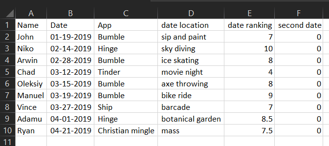

```{r setup0, echo = FALSE, include = FALSE}
regdat <- read.table("files/regdat.csv", sep = ',', col.names = c("sex", "age", "height", "weight"))


knitr::opts_chunk$set(echo = FALSE)
library(knitr)
library(ggplot2)
library(tidyverse)
library(xaringanExtra)
library(emo)
library(ggpubr)
library(moments)
library(car)

```

```{r xaringanExtra-clipboard, echo=FALSE}
xaringanExtra::use_clipboard()
```


## LAB MATERIALS

### Lab 01 Goals

* Estimate crude measures of (linear) association using univariable linear regression models  
* Estimate crude measures of non-linear association using univariable linear regression models with linear transformed and categorical variables.  
* Estimate adjusted measures of association using multivariable linear regression models

### Data and assignment

The assignment and dataset are both available on [Sakai](sakai.duke.edu).


### Lab 01 Grading scheme

| Competency | Points |
|:-----------|:------:|
|   Table 1a - Pearson CC |   3  |
|   Table 1b - Spearman rank CC  |   3   |
|   Table 2 - Univariate models  |   10  |
|   Table 3 - F Statistic |   3  |
|   Task 4 - Multivariate models |   10  |
|   Figures |   15 (1 point each)  |
|   Short answers 1 - 8 |   56 (7 points each)  |
|   __Total__  |  __100__  |


### Packages

* {moments}
* {car}
* {tidyverse}


# Competencies:

## Import data from `.csv`

### Comma separated values (`.csv`)

CSV stands for "comma separated values". It's a way of organizing data. When a file extension reads `.csv`, spreadsheet applications like Excel understand that to mean that the data are stored according to a simple set of rules. 

See if you can spot the pattern.

The raw data might look like this:

```{r include = TRUE, eval = FALSE, echo = TRUE}

Name, Date, App, date location, date ranking, second date
John, 01-19-2019, Bumble, sip and paint, 7, 0
Niko, 02-14-2019, Hinge, sky diving, 10, 0
Arwin, 02-28-2019, Bumble, ice skating, 8, 0
Chad, 03-12-2019, Tinder, movie night, 4, 0
Oleksiy, 03-15-2019, Bumble, axe throwing, 8, 0
Manuel, 03-19-2019, Bumble, bike ride, 9, 0
Vince, 03-27-2019, Ship, barcade, 7, 0
Adamu, 04-01-2019, Hinge, botanical garden, 8.5, 0 
Ryan, 04-21-2019, Christian mingle, mass, 7.5, 0
```

And a spreadsheet application (e.g. Microsoft Excel) would display the data like this:



Which in R Studio, would look like this:

```{r include = TRUE, echo = FALSE}

knitr::kable(tribble(
  ~Name, ~Date, ~App, ~`date location`, ~`date ranking`, ~`second date`,
"John", "01-19-2019", "Bumble", "sip and paint", 6.9, 0,
"Niko", "02-14-2019", "Hinge", "sky diving", 9.9, 0,
"Arwin", "02-28-2019", "Bumble", "ice skating", 8.2, 0,
"Chad", "03-12-2019", "Tinder", "movie night", 4.4, 0,
"Oleksiy", "03-15-2019", "Bumble", "axe throwing", 8.3, 0,
"Manuel", "03-19-2019", "Bumble", "bike ride", 8.9, 0,
"Vince", "03-27-2019", "Ship", "barcade", 7.3, 0,
"Adamu", "04-01-2019", "Hinge", "botanical garden", 8.5, 0,
"Ryan", "04-21-2019", "Christian mingle", "mass", 7.5, 0))
```


<details>
<summary>Expand for the four simple rules of .csv data </summary>

* commas delineate columns

* a new line delineates a new row

* the first row of data determines column names and number of columns

* the values between commas are data

</details>

### Import from .csv (`read.csv()`)

`read.csv()` works a lot like `readRDS()`, except it can interact with .csv files.

Before you try to import your data, do yourself a favor and open the .csv file in Excel to inspect it.


Now that you've done that, note that `read.csv()` allows the following arguments relevant to importing this lab's data:

* `file = ""` - just like `readRDS`, you need to provide a file name in quotes
* `header = ` - this argument takes either `TRUE` or `FALSE`. If set to `TRUE`, the function will use the first row of the data as the column names ("headers")
* `col.names = c()` - takes a vector that is the same length as the number of columns in the dataset. It will use the values in this vector as the column names.

Here is an example:

```{r echo = TRUE, eval = FALSE}
data <- read.csv("regdat.csv", header = FALSE, 
                 col.names = c("columnA", "columnB", "columnC", "columnD"))
```

<aside>
__Don't forget__ to use `<-` to assign a name to your imported data frame!
</aside>


## Plots with {ggplot2}

### Histograms (`geom_histogram()`)

If you need a refresher on creating histograms with {ggplot2}, you can find it [here](https://dghi-biostat.github.io/biostatlab/help_ggplot2.html#create-a-histogram-with-geom_histogram).

### Scatter plots (`geom_point()`)

We create scatter plots by assigning an `x` and `y` aesthetic (`aes()`) to a ggplot object, and then adding a layer called `geom_point()`

```{r}
ggplot(data = iris, aes(x = Petal.Length, y = Sepal.Length)) +
  geom_point()
```


### Q-Q Plots (`qqnorm()`)

A Q-Q plot allows us to compare a variable's observed distribution against its "theoretical" distribution. It does this by taking a continuous variable, converting each value to a Z-score (using the variable's mean and standard deviation), and then plotting the Z-score against the original observed value.

To do this in R, we might start by creating a `qqnorm` object using `qqnorm()`:

As an example, here are first 10 values of `regdat$weight`. "Observed Values" are the actual data, and "Z-values" are the Z-score for each of those values of `weight`:

```{r include = FALSE}
qq_data <- data.frame(qqnorm(regdat$weight)[2:1])

names(qq_data) <- c("Observed Values", "Z Values")
```

```{r echo = FALSE}
knitr::kable(head(qq_data, 10))
```

We can use `qqnorm()` to calculate and plot these values automatically!

Here is the Q-Q plot for `regdat$weight`, with histogram for reference. Notice that the y-axis is labelled "Sample Quantiles" and its range is the minimum and maximum weight in regdat, while the x-axis is labelled "Theoretical Quantiles" and ranges from -3 to 3. __Why might that be?__

```{r echo = TRUE, fig.show='hold', out.width = '50%'}
qqnorm(regdat$weight, main = "Normal Q-Q Plot of Weight (lbs.)")
hist(regdat$weight)
```

<aside>
If `weight` were normally distributed, we would expect a straight diagonal line. See the "Note on Q-Q plots" below for an example of this.
</aside>

### Note on Q-Q Plots

For a quick comparison, we can use a simple model to visualize how a truly normal distribution would appear on a Q-Q plot:

<aside>
[This page](https://data.library.virginia.edu/understanding-q-q-plots/) from U Virginia is an excellent resource.
</aside>

If we extract the mean and standard deviation from our height, we can construct a normal distribution and plot it.

```{r, fig.show='hold', out.width = '33%', echo = TRUE, eval = TRUE}
# calculate mean of height
x_hat <- mean(regdat$height)
# calculate sd of height
x_sd <- sd(regdat$height)
# simulate a normal distribution using height's mean and sd
normal <- rnorm(500, mean = x_hat, sd = x_sd)
# scatter plot
plot(normal)
# histogram
hist(normal)
# Q-Q plot
qqnorm(normal)
```

#### Bonus: `qqnorm()`, but with `ggplot()`

__For those interested:__

Remember the discussion about how most objects contain more information than initially meets the eye?

The same goes for `qqnorm` objects. They aren't just a bunch of dots. They contain vectors of the theoretical and observed ("Sampled") quantiles. If we convert the `qqnorm` object to a `data.frame`, we can use `ggplot()` to call those specific columns for plotting. Let's look at how we would make a Q-Q plot for the natural log of `weight`:

```{r echo = TRUE, fig.show='hold', out.width = '50%'}
# calculate ln_wt
regdat$ln_wt <- log(regdat$weight)

# create qqnorm() object and convert to data.frame() object
qqnorm_data <- data.frame(qqnorm(regdat$ln_wt, plot.it = FALSE))

# plot in ggplot
ggplot(data = qqnorm_data, aes(x = x, y = y)) +
  geom_point(shape = 1, size = 3) + 
  labs(title = "Q-Q plot for ln(weight)") +
  xlab("Theoretical Quantiles for ln_wt") +
  ylab("Sample Quantiles for ln_wt")
```


## Creating new variables

### `log()` transform

In R, `log()` takes the natural log of a given value:

```{r echo = TRUE, eval = TRUE}
log(10)

#> [1] 2.302585
```

If given a vector of values, `log()` will take the natural log of each of those values individually:

```{r echo = TRUE, eval = FALSE}
simple_vector <- c(1, 10, 100, 1000)

log(simple_vector)

#> [1] 0.000000 2.302585 4.605170 6.907755
```

Not relevant to Lab 01, but you can also specify what base you want your log to be in with the argument `base = `:

```{r echo = TRUE, eval = FALSE}
log(simple_vector, base = 10)

#> [1] 0 1 2 3
```


#### Why do a log transformation?


Imagine we have a variable that is highly right-skewed. The histogram of that variable might look something like this:


```{r echo = FALSE, warning = FALSE, message = FALSE}
set.seed(123)
skewed <- data.frame(skewed_var = rbeta(100, shape1 = 2, shape2 = 5, ncp = 0)^2)

ggplot(skewed, aes(x = skewed_var)) + #regdat, aes(x = weight)) +
  geom_histogram(fill = "forestgreen") +
  labs(x = "A skewed variable", y = "Count", title = "Histogram of a skewed variable")
  #stat_overlay_normal_density(color = "black", linetype = "dashed", size = 1)
```


We can use a natural log transformation to make the variable's distribution more "normal", and therefore suitable for linear regression:

```{r echo = FALSE, message = FALSE}
skewed$log_var <- log(skewed$skewed_var)

ggplot(skewed, aes(x = log_var)) + 
  geom_histogram(fill = "forestgreen") +
  labs(x = "log(A skewed variable)", y = "Count", title = "Histogram of a skewed variable")
  #stat_overlay_normal_density(color = "black", mapping = aes(x = log(skewed_var)), linetype = "dashed", size = 1) #+
  #xlim(-0.0001, 0.7)
```

<aside>
For more on transforming data into a normal distribution, see [this link](https://www.datanovia.com/en/lessons/transform-data-to-normal-distribution-in-r/)
</aside>

The natural log transformation uses 'Euler's number' (2.718) as its 'base' (in contrast, a base 10 log transformation uses 10 as the base). So: 

$$
\begin{eqnarray}
ln(2) &=& 0.693\\
\rm{because} \ 2.718^.693 &=& 2
\end{eqnarray}
$$

Using a log transformation can help to 'pull in' outlier values, which has the benefit of making the distribution more Normally distributed and reduce skew, although it doesn't affect kurtosis. 

### Squaring with `^2`

In R, you can raise a base by any exponent using `^`. For example, 10^3^ would be written like this:

```{r echo = TRUE, eval = FALSE}
10^3

#> [1] 1000
```

If you give R a vector of numbers, followed by an exponent, it will perform the operation on each value individually:

```{r echo = TRUE, eval = FALSE}
simple_vector <- c(3, 3.3, 12, 1)
simple_vector^2

#> [1]   9.00  10.89 144.00   1.00
```

<aside>
Recall that data frames are just lists of vectors! 

You might consider using `%>%` and [`mutate()`](https://dghi-biostat.github.io/biostatlab/lab_0.html#task-6-create-variable-mage) to create a squared variable.
</aside>


### Categorical variables with `case_when()`

For a refresher on how to generate categorical variables from continuous variables, you can refer back to when we [__created `magec`__](https://dghi-biostat.github.io/biostatlab/lab_0.html#task-8-create-variable-magec) in last 705, Lab 0.

## Skewness and Kurtosis ({moments} package)


In evaluating the skewness and kurtosis values, a variable that is perfectly normally distributed will have a skewness of 0 and a kurtosis of 3. 

So for example, if a variable has a skewness of -0.05 and a kurtosis of 2.2, we would conclude that the data are slightly left skewed (negative value) and there is some kurtosis. 

More specifically, because kurstosis, 2.2 < 3, we conclude that there are less data in the tails. If the value for kurtosis had been greater than 3, we would have concluded that the variable has more data in the tails than expected under a normal distribution.

<aside>

[Here is a link](https://www.analyticsvidhya.com/blog/2021/05/shape-of-data-skewness-and-kurtosis/) if you'd like to read more about it.

</aside>

In R, we can calculate both skewness and kurtosis using a package called {moments} and its handy functions `skewness()` and `kurtosis()`:

```{r eval = FALSE, echo = TRUE}
skewness(regdat$weight)

kurtosis(regdat$weight)

#> [1] 0.5843876
#> [1] 3.765937

```

<aside>
You will need to install {moments} with `install.packages("moments")`
</aside>

## Pearson and Spearman rank correlation coefficients

We use correlation coefficients to measure the strength and direction of the linear association between two continuous variables.

Correlation coefficients can range from -1 to 1. Values closer to 1 represent a strong __positive__ correlation. Those closer to -1 represent a strong __negative__ correlation. The closer the correlation coefficient, R, is to 0, the weaker the association between the two variables.


```{r  fig.show='hold', out.width = '33%', dpi = 300, fig.height=3, fig.width=3, warning = FALSE, message = FALSE}

# generating toy data-- this will not appear on the rendered site

toy <- data.frame(ran1 = rnorm(150, 20, 5), ran2 = runif(150, 0, 40))

toy <- arrange(toy, ran1)

toy <- toy %>%
  mutate(ran2 = ifelse(ran1 < 20, ran2 * jitter(0.95, amount = 0.1), ran2 * jitter(1.1, amount = 0.05)))

toy$pos <- jitter(seq(20,70, length.out = 150), amount = 20)

toy$neg <- jitter(seq(75,25, length.out = 150), amount = 20)

#Rpos <- cor(toy$, toy$)
R0 <- cor(toy$ran1, toy$ran2)
Rneg <- cor(toy$ran1, toy$neg)
Rpos <- cor(toy$ran1, toy$pos)

######################################################

ggplot(toy, aes(x = ran1, y = neg)) +
  geom_point(color = "red") +
  geom_smooth(method = "lm", color = "black") +
  labs(x = "X", y = "Y", title = paste("R (pearson)= ", round(Rneg,2), sep = ""))


ggplot(toy, aes(x = ran1, y = ran2)) +
  geom_point(color = "grey") +
  geom_smooth(method = "lm", color = "black") +
  labs(x = "X", y = "Y", title = paste("R (pearson) = ", round(R0,2), sep = ""))

ggplot(toy, aes(x = ran1, y = pos)) +
  geom_point(color = "green") +
  geom_smooth(method = "lm", color = "black") +
  labs(x = "X", y = "Y", title = paste("R (pearson) = ", round(Rpos,2), sep = ""))
```

To calculate in R, use the function:
```{r eval = FALSE}
cor(x, y, 
    method = c("pearson", "kendall", "spearman"))` 
```

Specify your x and y variables and set the method to your cheeky brit of choice. 

<aside>
The __Pearson__ is the parametric test. Both __Spearman__ and __Kendall__ refer to rank-based (non-parametric) measures of association for when our data are non-normal.
</aside>

If no method is specified, "pearson" is the default.


### *Bonus:* Correlation coefficient matrices

If you want to have a very particular kind of fun, try the following:

1. Take your `regdat` data and create a new data frame of only continuous variables from `regdat`. Give it a new name, like `cont_data`.  
2. Use R to run `cor(cont_data)`, where the data frame of continuous variable vectors is the only argument.

<aside>
You can use {dplyr}'s `select()` to [remove variables](https://www.marsja.se/how-to-remove-a-column-in-r-using-dplyr-by-name-and-index/) by name. But there are also [many](https://statisticsglobe.com/r-remove-data-frame-columns-by-name) [many](https://www.listendata.com/2015/06/r-keep-drop-columns-from-data-frame.html) ways to do this.
</aside>

What did it do? (Go look at Table 1 in the assignment.)


## Linear Regression Models

Building models in R is fun!

### Univariate (single-variable) models with `lm()`

Remember the concept of [R formulas](https://www.datacamp.com/community/tutorials/r-formula-tutorial)?

Regression models make use of formulas in a very intuitive way. Here is the general format:

```{r echo = TRUE, eval = FALSE}
lm(response_var ~ predictor_var, data = a_data_frame)
```

`lm` stands for "linear model". If we assign a name to our model, we can access various components within the model, which we can index with `$`. 

We can also just use `summary()` to view an overview of the model's most important components.

```{r echo = TRUE}
m1 <- lm(Sepal.Length ~ Petal.Length, data = iris)
summary(m1)
```

### Multivariable models with `lm()`

You can also use `lm()` to program models with multiple linear predictor variables. You can formulate your equation as you build your model, using arithmetic operators on the right-hand side of the formula:


```{r echo = TRUE, eval = FALSE}
lm(response_var ~ predictor_var1 + predictor_var2, data = a_data_frame)
```

```{r echo = TRUE}
mlm1 <- lm(Sepal.Length ~ Petal.Length + Species, data = iris)

summary(mlm1)
```

### Linear models: a brief tour

In this section, we'll show you how to access a model's coefficients, confidence intervals, residuals, and other values that might come in handy.

Remember how we said that you can extract numbers from your model when you assign it a name? If we inspect `m1` using `$` to index the object by name, we'll see some useful items at our disposal.

You can obtain the model's coefficients with `coef(your_model)`. For example:

```{r echo = TRUE, eval = TRUE}
coef(m1)
```

And you can calculate 95% confidence intervals with `confint(your_model, level = 0.95)`. For example:

```{r echo = TRUE, eval = TRUE}
confint(m1,  level = .95)

```

And don't forget that you can inspect your model with `summary()`:

```{r echo = TRUE, eval = TRUE}
summary(m1)
```

Our model contains the columns of data (variables) used in its calculation:

```{r echo = TRUE}
head(m1$model)
```


It also has the resulting fitted values:

```{r  echo = TRUE, eval = TRUE}
head(m1$fitted.values)
```
The fitted values are what result when we plug each row into the model equation. We can use the first row of our data to observe this directly:

```{r  echo = TRUE, eval = TRUE}
x <- m1$model[1,2] # Petal.Length of row 1

B0 <- m1$coefficients[1] # beta-naught

B1 <- m1$coefficients[2] # beta-one

# formula:
fitted <- B0 + B1 * x
fitted
```
The resulting value is the "fitted" value, or the estimate of the response variable according to our model, given the value of the predictor, `Petal.Length` (which for the first row in our data, is `r x`).


Notice that our model also contains residuals, or the differences between our observed values for y (our response variable), and the values predicted by our model:

```{r  echo = TRUE, eval = TRUE}
head(m1$residuals)
```
We can find the first row's residual value with the `fitted` value that we calculated above:

```{r  echo = TRUE, eval = TRUE}
# observed Sepal.Length of row 1 minus the predicted/fitted value:
m1$model[1,1] - fitted
```

## Plotting line of best fit

{ggplot2} provides a wide variety of flexible tools for visualizing models. There are two main ways we might visualize a regression model. The best way to do this is to fit the model and then plot the prediction (often referred to as the line of best fit)

You can also use functions within {ggplot2} to generate a line of best fit. This is a technique that we will encounter later in the semester that is handy in special circumstances. But for now, __please use the method that follows__.

<aside>
[__Here__](https://stats.idre.ucla.edu/r/faq/how-can-i-explore-different-smooths-in-ggplot2/) is a highly useful tutorial for how to plot different models in {ggplot2}. It includes splines, Loess, and multiple variations on quadratics.
</aside>


### Model first, then plot

We can plot our data and line of best fit by using a model as the data object required by {ggplot2}.

Remember our example model from earlier:

```{r}
summary(m1)
```

`m1` will serve as our data object within `ggplot()`. We can start by creating a scatter plot of the response and predictor variables from our formula. But instead of using the original data frame (`regdat`), we'll use `data = m1`:

```{r echo = TRUE}
p <- ggplot(data = m1, aes(x = Petal.Length, y = Sepal.Length)) +
  geom_point()

p
```

<aside>
Notice that we have assigned a name to our plot, `p`. By doing this, we can add layers to the original plot without needing to reproduce the code each time.
</aside>

From here, we can add a `geom_smooth()` layer to fit an ordinary least squares regression line to our data. Notice that within the model `m1`, we have access to a variable, `.fitted`. We need to assign this to the y-axis of our plot. This will plot a line for `Petal.Length` against our fitted/predicted values! 

```{r echo = TRUE, message = FALSE}
p + geom_smooth(aes(y = .fitted))
```

Understanding how this method works will become more important as our models increase in complexity. It also will helps in plotting residuals (see [next section](https://dghi-biostat.github.io/biostatlab/lab_01.html#residuals-plots)).

### Plot first, then model

To perform this method, we need to start with a scatter plot using {ggplot2}:

```{r echo = TRUE}
p2 <- ggplot(data = toy, aes(x = ran1, y = pos)) +
  geom_point() +
  labs(x = "Age (years)", y = "Points", title = "This is fake data")

p2
```


Once we have our plot, we just need to add another layer, `stat_smooth()`, and designate a method and formula. Here, we're building a univariate, linear model. Observe how we parameterize these details within the `stat_smooth()` function:

```{r echo = TRUE}
p2 + stat_smooth(method = "lm", formula = y ~ x)
```


Notice that if we don't designate a method, `stat_smooth()` will default to plotting a smoothed "loess" line, which we'll learn more about later in the semester:

```{r echo = TRUE, warning = FALSE, message = FALSE}
p2 + stat_smooth(formula = y ~ x)
```

For those curious, we can also print our model's equation in the plot. The code is a bit dense, but straightforward: 

```{r echo = TRUE}
require(ggpmisc)

p2 + stat_smooth(method = "lm", formula = y ~ x) +
  stat_poly_eq(formula = y ~ x, 
                aes(label = paste(..eq.label.., 
                                  ..rr.label.., 
                                  sep = "~~~")), 
                parse = TRUE)
```

<aside>
From [this post](https://stackoverflow.com/questions/7549694/add-regression-line-equation-and-r2-on-graph) on SO.
</aside>

## Model Evaluation

Once we've built a model, there are various measures we might use to evaluate how well that model fits our data. Here we discuss two of those measures: __residuals__ and __heteroscedasticity__.

### Residuals plots

Our model object contains a vector of residuals, which are the observed Y minus the predicted Y:

```{r echo = TRUE, eval = TRUE}
head(m1$residuals)
```

We could generate a histogram of our residuals. In the following code, notice that {ggplot2} finds our residuals when we refer to them as `.resid`: 

```{r echo = TRUE}
ggplot(data = m1, aes(x = .resid)) + 
  geom_histogram(binwidth = .1, fill = "seagreen") +
  xlab('Residuals') +
  ggtitle("Histogram of residuals of Iris Petal Length regressed on Sepal Length")
```


But we can also use that vector of residuals, `.resid` to create a scatter plot of our fitted data against our residuals:

```{r echo = TRUE}
ggplot(data = m1, aes(x = .fitted, y = .resid)) +
  geom_point() +
  geom_hline(yintercept = 0, linetype = "dashed") +
  labs(x = "Fitted values", 
       y = "Residuals", 
       title = "Residual plot of iris petal length regressed on sepal length")
```
<aside>
Notice that we have added a dashed horizontal line at `y = 0` by adding a layer to our plot:
`+ geom_hline(yintercept = 0, linetype = "dashed")`
</aside>


This tells us if there is any bias in our model's fit.

One such trend we might observe is heteroskedasticity, 


### Heteroskedasticity

Simply put, heteroskedasticity is when the variability of Y (our response variable) is different depending on X (our predictor variable).

In the following plot, where along the x-axis would we be able to accurately predict Y using a linear model?

```{r}
# making more toy data, this time to show heterskedasticity
x <- jitter(c(1:100), 5)

y <- jitter(runif(100, 1,3), amount = 1)

z <- x * y

het <- data.frame(x, z)

m_het <- lm(z~x, data = het)
```


```{r echo = TRUE}
ggplot(het, aes(x = x, y = z)) +
  geom_point() +
  labs(x = "X", y = "Y", title = "More fake data")
```
<aside>
[Wikipedia](https://en.wikipedia.org/wiki/Heteroscedasticity) is telling me that this is Greek for "different" (*hetero*) "dispersion" (*skedasis*)
</aside>

The data above are __heteroskedastilisticexpialidocious.__

<aside>
[Link, for the Disney lovers](https://youtu.be/dQw4w9WgXcQ)
</aside>

#### Breusch-Pagan/Cook-Weisberg

We can use a chi-squared test to assess __how heteroskedastic__ our data really are. We can do this using `ncvTest()` from the package {car}.

Here's a test of our iris model, whose residuals we visualized above:

```{r echo = TRUE}
ncvTest(m1)
```

<aside>
For proof of method, see ["References" section in documentation](https://www.rdocumentation.org/packages/car/versions/1.2-6/topics/ncv.test)
</aside>

Meanwhile, here's a Breusch-Pagan test of the heteroskedastilistic data above. Notice the p-value:

```{r echo = TRUE}
ncvTest(lm(z~x, data = het))
```


## Model comparison

We can use an F-statistic to compare models when we add or omit variables. Section 9.2 of OpenIntro contains a great introduction to model selection. In it, they recommend two different model selection strategies:

1. __Backwards elimination__ - where we generate a fully saturated model, then take one variable out at a time.

2. __Forward selection__ - where we start with a single predictor variable, and add one new variable at a time.

With each step in either of these processes, we need some kind of test to help us evaluate if the removal/addition of a variable has *improved* the model.

In OpenIntro, they use R^2^. But we can also use an F-test.

### F-test

Use `anova(aModel, anotherModel)` to compute the F-statistic for the comparison of two models. 

[Further up](https://dghi-biostat.github.io/biostatlab/lab_01.html#univariate-single-variable-models-with-lm) on this page, we created a model that aimed to predict `iris` sepal length using measures of iris petal length.

Here's that model's summary:

```{r echo = TRUE}
summary(m1)
```

We may wonder if using a quadratic formula renders a better model:

```{r echo = TRUE}
m1_quadratic <- lm(Sepal.Length ~ Petal.Length + I(Petal.Length^2), data = iris)
summary(m1_quadratic)
```

Compare the two outputs and notice that our Adjusted R-squared has increased. This is a good sign.

But an F-statistic quantifies the difference in model fit between two models:

```{r echo = TRUE}
anova(m1, m1_quadratic, test = "F")
```


<aside>
If you want to know more about how this test is performed, [this article](https://stats.libretexts.org/Bookshelves/Applied_Statistics/Book%3A_Learning_Statistics_with_R_-_A_tutorial_for_Psychology_Students_and_other_Beginners_(Navarro)/16%3A_Factorial_ANOVA/16.05%3A_The___F___test_as_a_model_comparison) by Danielle Navarro is a great place to look.
</aside>

The main thing of importance when performing an F-test on two models is that the smaller of the two models (the "null" model) cannot contain variables that are not in the larger model (the "alternative" or "full" model).

