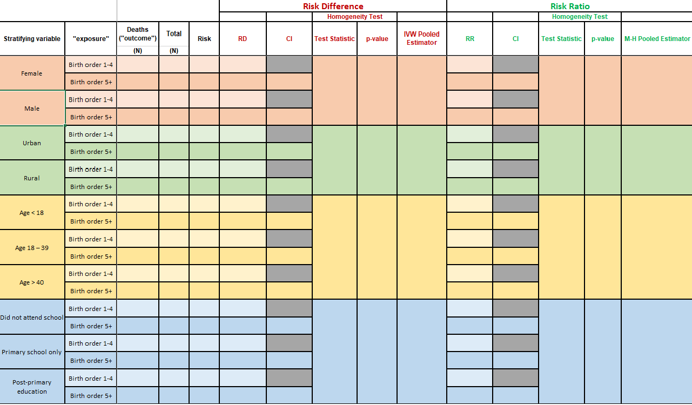
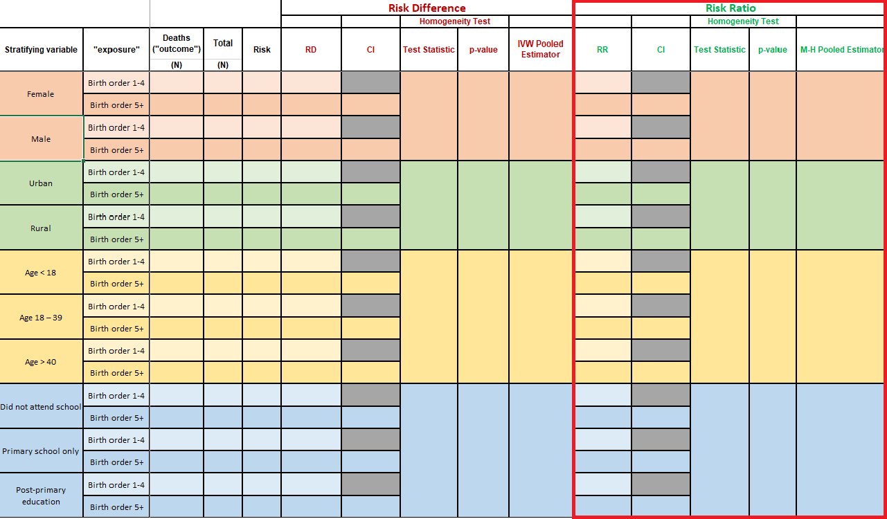

```{r setup, include=FALSE}
knitr::opts_chunk$set(echo = FALSE)
library(knitr)
library(tidyverse)
library(xaringanExtra)
library(epiAssist)
library(epiR)
```

```{r xaringanExtra-clipboard, echo=FALSE}
xaringanExtra::use_clipboard()
```

### LAB MATERIALS 

* [__R Markdown file for Lab 4__](assignments/lab4_705_fall2021.Rmd)
Click link to download. Fill it in with your answers to the following lab tasks. When you're ready to submit, name it as `Lab4_FirstinitialYourlastname.Rmd`, and submit it using the Sakai dropbox.

* [__Excel document with Table for Task 2__](assignments/Lab4_Tables.xlsx)

* Lab_4_kenya.rds - data file available on Sakai

### Lab 2 Goals

* Calculate measures of association between birth order and child mortality by 5 years within strata of other variables

* Assess potential for confounding and effect modification (mediation) by those other variables.

### Lab 4 Grading scheme

| Competency | Points |
|:-----------|:------:|
|   .Rmd file runs without error |   10  |
|   Table 1 - Frequency counts and Risk  |   20  |
|   Table 1 - Risk difference  |   20   |
|   Table 1 - Risk ratio  |   20  |
|   Question 3 |   15  |
|   Question 4 |   15  |
|   __Total__  |  __100__  |


# Lab 4

## Task 1: Load libraries & data

__For this assignment, use the dataset 'Lab_4_kenya.rds'.__

This lab will also require the the packages {tidyverse}, {fmsb}, {epiR}, and {epiAssist}

You may need to install {fmsb}. You can do so with the following code:

```{r eval = FALSE, echo = TRUE}
install.packages("fmsb")
```


Hopefully at this point in the semester, you have a pretty good grasp on how to load libraries and data. But if you're still unsure about something:

[Help loading libraries](https://dghi-biostat.github.io/biostatlab/lab_0.html#load-libraries)
[Help loading data](https://dghi-biostat.github.io/biostatlab/lab_0.html#task-4-load-data)

## Task 2: Table 1

__INSTRUCTIONS:__ Generate frequency counts of 5-year mortality (`death`) according to child's birth order (`bord5`), stratified by the following variables:
    + `male`
    + `rural`
    + `magec`
    + `education`

Use Table 1 to record frequency counts and strata-specific risk of death before 60 months, by birth order. Then, use `epi.2by2()` to generate stratified measures of risk difference, risk ratios, and their accompanying confidence intervals. 

You will also use the resulting `epi.2by2()` object to extract test statistics and p-values that test for potential confounding by the stratifying variables. 

Finally, you will use a pooled estimate of risk difference and risk ratio to assess for effect measure modification by each of the stratifying variables.

Below is a detailed guide on how to complete each stup of these instructions.

### Tabular analysis of stratifying variables

Table 1 is an example of a stratified analysis of exposure and outcome variables. Essentially, we want to know if the four variables listed in the first part of Task 2 are confounders or effect measure modifiers of the relation between birth order and 5-year infant mortality. In other words, is the difference in mortality status of children of various birth orders at all different between boys and girls? What about rural and urban families? Mothers of different age categories? And so on...

When you open the Excel file that contains __Table 1__, here is what you will see:



<aside>If you haven't already, download the Excel file [at the top of this page](https://dghi-biostat.github.io/biostatlab/lab_4.html#lab-materials) to access __Table 1__ </aside>

We will break __Table 1__ into sections, and walk you through how to obtain these values in R.

### Step 1: Stratified frequency counts and risk

__INSTRUCTIONS:__ Fill in the table with the numbers of deaths (`death`, the outcome) and the 60-month risk of death according to birth order (`bord5`, the exposure), stratified by:

  a)	Child’s gender (variable `male`)  
  b)	Rural/urban residence (variable `rural`)  
  c)	Maternal age (variable `magec`)  
  d)	Maternal education (variable `education`)  


  
For this task, we recommend that you create a table object with `table()`, similar to [the one you created in lab 3](https://dghi-biostat.github.io/biostatlab/lab_3.html#step-1-create-a-table-object-with-table), where your outcome of interest is mortality (`death`) and your exposure of interest is child birth order (`bord5`). Except this time, include a third stratifying variable.

<aside> If you've been enjoying the tidyverse, feel free to use `group_by()` and `count()` But the table object will be useful in later steps.</aside>

`table()` allows for an unlimited number of stratifying levels. You keep listing variables, and `table()` will keep splitting the data into subsets. 

Say that we created a binary variable in our `kenya` dataset that indicated whether or not a mother's BMI was above or below 25 kg/m^2^. Here is an example of a set of contingency tables of `bord5` and `death`, stratified by that third variable, `mbmi_25`:


```{r echo = TRUE, eval = FALSE}
mbmi_tab <- table(kenya$bord5, kenya$death, kenya$mbmi_25)

mbmi_tab

#> , ,  = <25
#> 
#>                     
#>                      Alive Dead
#>   1-4 in Birth Order  7931 1071
#>   5+ in Birth Order   2180  409
#> 
#> , ,  = >=25
#> 
#>                     
#>                      Alive Dead
#>   1-4 in Birth Order  3700  374
#>   5+ in Birth Order    773  146
```

Here, our stratifying variable is `mbmi_25`, which separates our tabulated data into two tables according to mothers who have a BMI greater than or equal to 25, and those with BMI less than 25.

We can generate row-wise proportions of our table by wrapping the table object in the `proportions()` function.

<aside> row-wise proportions, a.k.a. __RISK of DEATH!__ </aside>

```{r echo = TRUE, eval = FALSE}

proportions(mbmi_tab, margin = c(1, 3))


#> , ,  = <25
#> 
#>                     
#>                           Alive       Dead
#>   1-4 in Birth Order 0.88102644 0.11897356
#>   5+ in Birth Order  0.84202395 0.15797605
#> 
#> , ,  = >=25
#> 
#>                     
#>                           Alive       Dead
#>   1-4 in Birth Order 0.90819833 0.09180167
#>   5+ in Birth Order  0.84113166 0.15886834
```

<aside> The argument `margin = ` designates the margins to split our table by when deriving proportions. By putting `margin = c(1,3)`, we restrict our calculation of proportions to row (`1`) and strata (`3`). Notice how each row sums to 1. Try playing with this configuration to see how it works.</aside>


### Step 2: Create `epi.2by2()` object

__INSTRUCTIONS:__ Create an `epi.2by2()` object for each of the tables you generated above. 

`epi.2by2()` works just like `mAssoc()`, so we need to rearrange out tables so that our outcome of interest and exposure of interest are in the top-left corner of each table. 

Good news: The function `flipTable()` is designed to work with stratified tables too!

Do the following:

  a.  `flipTable()` so that the topmost index level of the exposure and the outcome of interest is in the top-left corner of the table. 
  
```{r echo = TRUE, eval = FALSE}
mbmi_flip <- flipTable(mbmi_tab)
```

  b.  Create an `epi.2by2()` object by using the `flipTable()` object.
  
```{r echo = TRUE, eval = FALSE}
mbmi_epi <- epi.2by2(mbmi_flip, units = 1, conf.level = 0.95)

mbmi_epi
```

<aside>We set `units = 1` to obtain risk difference as a proportion. Setting to `100` would give use risk "per 100 persons". </aside>


### Step 3: Extract estimates of risk difference

__INSTRUCTIONS:__ Use the `epi.2by2()` object to extract the measure of risk difference for mortality in association with `bord5` *within* each covariable stratum__  


__IMPORTANT:__ The output for `epi.2by()` is NOT the full extent of the information contained within an `epi.2by2()` object! There is more to every object than what meets the eye.

When you call an `epi.2by2()` object, you will notice that its printed output is a lot like that of `mAssoc()` from the previous lab. Except this time, there are "crude" and "M-H" estimates:


<aside>This output is what's called the object's ["print method"](https://riptutorial.com/r/example/1221/printing-and-displaying-strings)</aside>

But if you inspect the `epi.2by2()` object (either in your R Environment, or by typing the object's name, followed by `$`), you will find vectors, lists, data frames, and all sorts of sub-objects.

<aside> See [this link](https://dghi-biostat.github.io/biostatlab/help_jargon.html#section) if you are still uncertain about the functionality of `$`</aside>

Following is how to locate the necessary information for this portion of __Table 1__

#### a. Risk difference and 95% CI

To access the risk differences of individual strata, use the following path to refer to that exact component of your `epi.2by2` object:

```{r eval = FALSE, echo = TRUE}

object$massoc.detail$ARisk.strata.wald

```

<aside> Confused by the nomenclature? `massoc` is Measures of Association. `ARisk` is Attributable Risk. `strata` refers to strata-specific measures. `wald`...ask Larry or Liz. </aside> 

So to obtain our measures of risk difference within separate stratum of mothers with BMI < 25 and mothers with BMI >= 25, we can use the following code to obtain estimates of risk difference:

```{r eval = FALSE, echo = TRUE}
mbmi_epi$massoc.detail$ARisk.strata.wald

#>          est      lower      upper
#> 1 0.03900249 0.02344295 0.05456203
#> 2 0.06706667 0.04182403 0.09230931
```

You might notice that this returns a single estimate for each strata. Our table, however, asks for two estimates for each strata. What gives??

Since we have pre-defined "referent" and "index" levels, with a risk difference defined as "the level of interest minus the referent level", what's the result when our referent level is also our level of interest? 


#### b. Test of homogeneity and p-value

Inconveniently, `epi.2by2()` doesn't actually provide a chi-squared test of homogeneity of stratified risk differences. We can obtain this estimate by using the function `epiHomog()` on our `flipTable()` object.

If your original `flipTable` object is properly oriented, it should suffice. Use your `flipTable` object as an argument in the function `epiHomog()` to return the test statistic and p-value for a test of homogeneity at a significance level of 0.05:

```{r eval = FALSE, echo = TRUE}

epiHomog(flippedTable)

```

Using our `flipTable()` object that is stratified by mother's BMI, we would run the following code to obtain the resulting output:

```{r eval = FALSE, echo = TRUE}
epiHomog(mbmi_flip)

#>   A tibble: 1 x 2
#>    `Test statistic` `p-value`
#>              <dbl>     <dbl>
#>   1           3.44    0.0637
```


#### c. Standardized pooled estimate (Mantel-Haenszel?)
[[@liz should we be calling this a mantel-haenszel? The stata lab refers to it as an IVW pooled estimator, which was altogether confusing.]]
  
Finally, we want the pooled estimate of risk difference. You might have already found this in the original print method's output of our `epi.2by2()` object, where it's referred to as "Attrib risk in the exposed (M-H)".

But since we need to report this estimate to three decimal points, we need to reach into our `epi.2by2` object and find that Mantel-Haenszel pooled estimate. You can access it by calling the following path:

<aside>As per [lab submission guidelines](https://dghi-biostat.github.io/biostatlab/submit.html#rounding) on rounding </aside>

```{r eval = FALSE, echo = TRUE}

object$massoc.detail$ARisk.mh.wald

```

<aside>Here, `mh` stands for "Mantel-Haenszel"</aside>

Using our `epi.2by2()` object, `mbmi_epi`, we find this value and its resulting output as follows:

```{r eval = FALSE, echo = TRUE}

mbmi_epi$massoc.detail$ARisk.mh.wald

#>          est      lower      upper
#> 1 0.04662555 0.02684395 0.06640716
```
[[@liz is the following helpful or does it give away too much?]]

We would interpret this pooled result by saying that, when accounting for confounding in the exposure due to a third variable, risk of the outcome in the exposed was 0.05 (95% CI 0.03 to 0.07) higher than the unexposed.


### Step 4: Extract estimates of risk ratios

The process for obtaining risk ratios, test statistic for homogeneity between strata, and pooled estimates is very similar to that of obtaining risk differences. Except this time, we don't need a separate function for finding the test of homogeneity -- `epi.2by2()` generates the test statistic for homogeneity of risk ratios itself.



[[@liz-- is the following paragraph helpful?]]
Perhaps it's safe to understand this as meaning that testing for homogeneity on stratified risk ratios is a more common practice within the fields of Epi and Biostatistics. Nonetheless, it's helpful to see how the preferred test of significance might differ according to which measure of association is being used.


[[@liz is there also a reason pertaining to confounding/EMM for why we'd want to test for homogeneity across stratified risk differences?. Seems that the main thing used in evaluating for confounders is the pooled estimate. Or am I missing something?]]

#### Risk ratios

To extract risk ratios from an `epi.2by2` object, you can use the following path:

```{r eval = FALSE, echo = TRUE}

object$massoc.detail$RR.strata.wald

```

Again, when you're finding these risk ratios, consider what we're asking for in the table when we request the risk ratio of the referent group as it pertains to the referent group. What does it amount to when we take the ratio of something on itself?

Our `mbmi_epi` object renders the following output:

```{r eval = FALSE, echo = TRUE}
mbmi_epi$massoc.detail$RR.strata.wald

#>        est    lower    upper
#> 1 1.046320 1.027315 1.065676
#> 2 1.079734 1.048089 1.112334
```


#### Test of homogeneity

The test of homogeneity for risk ratios is available in the following location within our `epi.2by2` object

```{r eval = FALSE, echo = TRUE}

object$massoc.detail$wRR.homog

```

Performing this on our `mbmi_epi` object yields the following result:

```{r eval = FALSE, echo = TRUE}
mbmi_epi$massoc.detail$wRR.homog

#>   test.statistic df   p.value
#> 1       3.109451  1 0.0778392
```


#### Mantel-Haenszel pooled estimate of RR

The Mantel-Haenszel pooled estimate appears in the printed output when you call your `epi.2by2` object from the environment, and is titled "Inc risk ratio (M-H)". However, this is only reported to two decimals. To access the actual value instead of the rounded one, you can look for it in the following place within your `epi.2by2` object:

```{r eval = FALSE, echo = TRUE}

object$massoc.detail$RR.mh.wald

```

This results in the following output using our `mbmi_epi` object

```{r eval = FALSE, echo = TRUE}

mbmi_epi$massoc.detail$RR.mh.wald

#>        est    lower    upper
#> 1 1.055389 1.039048 1.071988
```

[[@liz same as above for risk difference, is this helpful or does it give away too much?]]

We would interpret this as meaning that when we account for confounding due to mother's BMI, the risk of experiencing the outcome among the exposed was 1.06 (95% CI 1.04 to 1.07) times greater than the outcome of experiencing risk among the unexposed.


