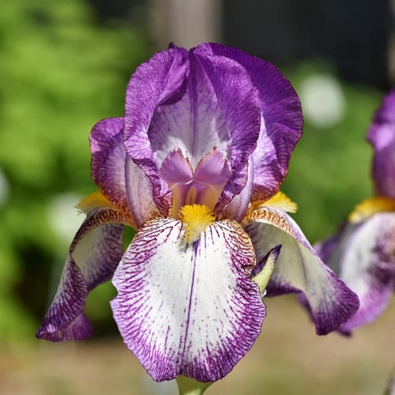

```{r setup, include=FALSE}
knitr::opts_chunk$set(echo = FALSE)

library(tidyverse)
```

## Goals:

By following along with this document, you will know how to:

* Read and interpret basic code in {ggplot2}'s *__grammar of graphics__*  
* Initialize a plotting field using `ggplot()`  
* Map x and y aesthetics to a plot's axes using `aes()`  
* Generate histograms  with `geom_histogram()`
* Generate boxplots and stratified boxplots with `geom_boxplot()`
* Create titles and axis labels with `labs()`
* Save a plot with `ggsave()`

Basically, this help document will provide you with the tools necessary to complete the labs for GLHLTH 705.


## External resources

If you're interested in going one level deeper, we highly recommend you check out the following resources, which will give a better introduction to {ggplot2} than we ever could (also why we're plugging these at the top). 

As R rule of thumb, it's good to have multiple mediums of exposure to the same idea. We recommend you pick the one that suits your learning style and come back for more later:

### __For the visually inclined:__ [RFun, Visualization with ggplot2 with John Little](https://rfun.library.duke.edu/portfolio/ggplot_workshop/)

John Little is nothing short of the world's best librarian.

### __For the linguistically inclined:__ 

[R for Data Science, Chapter 3, by Hadley Wickham](https://r4ds.had.co.nz/data-visualisation.html)

After a preface and introduction, this is *the first* actual chapter in R4DS. The rationale is that {ggplot2} is actually pretty fun and satisfying to use. It's pretty well guaranteed to have you hooked if you give it a chance.

### __For the theoretically inclined:__ 

["A Layered Grammar of Graphics" by Hadley Wickham](http://vita.had.co.nz/papers/layered-grammar.pdf)

Published in the Journal of Computational and Graphical Statistics, 2010


### __For the obsessively inclined:__ 

[*ggplot2: Elegant Graphics for Data Analysis*, by Hadely Wickham](https://www.springer.com/gp/book/9780387981413)

\*\*cough\*\* Also by Hadley Wickham. (look it up using [the Duke Library search engine](https://quicksearch.library.duke.edu/?q=ggplot2) and log in with your Duke credentials

### __For the listically inclined:__
[Reference page of ggplot2 commands](https://ggplot2.tidyverse.org/reference/)

## Core competencies for 705 lab

For those of you who made it through that onslaught of links without clicking on a single one, welcome to the Core Competencies section. We hope that this section is somehow dry enough that you go and find your answers in one of the resources above. But for those of you who are still feeling stubborn:

### Create a new ggplot with `ggplot()`

To initialize a plotting space, we first need to tell R that we want to use ggplot. If we just call `ggplot()` and run it without any data, we get a blank field. This is our sandbox:

```{r echo = TRUE}
ggplot()
```

### Add a dataset to the plot

For this example, we'll use the dataset available in base R called `iris`, which provides measurements and species data on a bunch of -- you guessed it -- irises. 

```{r eval = FALSE}
head(iris)
```
```{r}
knitr::kable(head(iris))
```


<aside>
```{r fig.dim = "50%", fig.cap = "[A bearded iris](https://cityfloralgreenhouse.com/flower-bulbs/bearded-iris-bulbs/)"}


```
</aside>

We can add the dataframe to our plot by including it in the argument `data = `.  

Superficially, this doesn't change our output:

```{r echo = TRUE}
ggplot(data = iris)
```
But the data frame is now a part of the plot. One way to verify this is by assigning the two previous plots a name and inspecting their size with `object.size()`. The plot with the data should be bigger:

```{r echo = TRUE, eval = FALSE}
without_data <- ggplot()

object.size(without_data)
#> 3720 bytes

with_data <- ggplot(data = iris)

object.size(with_data)
#> 10704 bytes
```

### Assign x and y aesthetics with `aes()`:

Next, we need to tell ggplot which variables we're working with, and where to put them (their "aesthetic mapping"). We do this using the argument `aes(x = variable1, y = variable2)` 

If we're creating histograms and singular boxplots, we only require a single variable on the x-axis. We can initialize it as follows:

```{r echo = TRUE}
ggplot(data = iris, mapping = aes(x = Sepal.Length))
```

See how ggplot assigned Sepal.Length to the x axis?

### Create a histogram with `geom_histogram()`

Okay, let's cut to the chase. We want a *__plot__*.

{ggplot2} has a large number of plotting types and styles. Given the types of variables we've mapped to ggplot's aesthetics, all we need to do is choose a type of plot appropriate for that type of variable, and *__add__* it as a new layer with `+` 

```{r echo = TRUE}
ggplot(data = iris, mapping = aes(x = Sepal.Length)) +
  geom_histogram()
```

Many plots also allow us to add color with the argument `aes(fill = "colorname")` (colors are always written as strings, in quotes!). 

We may also change the size of our bins with argument `binwidth = x`:

```{r echo = TRUE}
ggplot(data = iris, mapping = aes(x = Sepal.Length)) +
  geom_histogram(fill = "#12BBAC", binwidth = .25)
```
<aside>
Refer [here](http://www.stat.columbia.edu/~tzheng/../files/Rcolor.pdf) for a list of color options available in R.
Along with default color names, R also accepts __hexadecimal color codings__. For fun, I've made our histogram the same color as this website's navbar. Did it work?
</aside>


### Create a boxplot with `geom_boxplot()`

A single boxplot functions in the same exact manner. Instead of `geom_histogram()`, we add a boxplot layer with `geom_boxplot()`. This time, I've used a [default color name](http://www.stat.columbia.edu/~tzheng/../files/Rcolor.pdf), `goldenrod2`, instead of a hexadecimal color code: 

```{r echo = TRUE}
ggplot(data = iris, mapping = aes(x = Sepal.Length)) +
  geom_boxplot(fill = 'goldenrod2')
```


### Generate a stratified boxplot by adding a y aesthetic:

We can create multiple boxplots within a single plot by adding a categorical variable as a second aesthetic. The `iris` dataset contains a categorical variable, `Species`, which would be appropriate for this task:

```{r echo = TRUE}
ggplot(data = iris, mapping = aes(x = Sepal.Length, y = Species)) +
  geom_boxplot(fill = '#AC12BB')
```

We can also display the boxplots vertically by assigning `Sepal.Length` to `y = `  and `Species` to `x = `  :

```{r echo = TRUE}
ggplot(data = iris, mapping = aes(y = Sepal.Length, x = Species)) +
  geom_boxplot(fill = '#AC12BB')
```


### Create titles and axis labels with `labs()`

Finally, we need to make our plots fit for public use... it needs axis labels and a title. We can specify these by adding another layer to our plot, `labs()`. Make sure you write your labels as strings:

```{r echo = TRUE}
ggplot(data = iris, mapping = aes(y = Sepal.Length, x = Species)) +
  geom_boxplot(fill =  "#12BBAC") + 
  labs(x = "Species", 
       y = "Sepal Length", 
       title = "Boxplots of Sepal Length of Irises by Species")
```


### BONUS: Generating multiple stratified plots with `facet_wrap()` or `filter()`

You might be wondering what this sort of stratification might look life if we tried the same thing with a histogram. Can a histogram accept a y aesthetic? When we try and assign a second aesthetic to a histogram, we get the following result:

```{r echo = TRUE, eval = FALSE}
ggplot(data = iris, mapping = aes(x = Species, y = Sepal.Length)) +
  geom_histogram(fill = "goldenrod2")

#> Error: stat_bin() can only have an x or y aesthetic.
```


#### `facet_wrap()`

An easy way to generate stratified histograms is with the additional layer, `facet_wrap()`, which takes a formula in the following syntax:

`. ~ stratifyingVariable`

The period here represents our ggplot object. We put the stratifying variable on the right side of the formula as a way to designate it as the "independent variable" of sorts. The output, `.` , *depends on* whatever categorical we assign as our faceting variable. In this case, the histograms dependson the variable `Species`:

```{r echo = TRUE}
ggplot(data = iris, mapping = aes(x = Sepal.Length)) + 
  geom_histogram(fill = "goldenrod2") +
  facet_wrap(. ~ Species) + 
    labs(x = "Sepal Length", 
         y = "Count",
         title = "Histograms of Sepal Length of Irises by Species")
```

We might decide that we want the plots stacked vertically instead of horizontally to help us better compare their distributions by Sepal Length. We can do that too, with the argument `nrow = `:

```{r echo = TRUE, fig.width = 5, fig.height = 8}
ggplot(data = iris, mapping = aes(x = Sepal.Length)) + 
  geom_histogram(fill = "#AC12BB") +
  facet_wrap(. ~ Species, nrow = 3) +
  labs(x = "Sepal Length",
       y = "Count",
       title = "Histograms of Sepal Length of Irises by Species")
```

#### pipe and `filter()`

What if we only want the Sepal Lengths for the species *Iris virginica*?

One way would be to use `filter()`, which we connect to our ggplot using a pipe:


```{r echo = TRUE}
iris %>%
  filter(Species == "virginica") %>%
  ggplot(mapping = aes(x = Sepal.Length)) +
  geom_histogram(fill = "#12BBAC") + 
  labs(x = "Sepal Length", 
       title = "Histograms of Sepal Length of Irises by Species")
```

<aside>
Note that when we use a pipe for a ggplot, we've already specified the dataset at the top of the code, so we don't need to type it again when we call `ggplot()`. It already knows what data we're working with because `iris` is funneled along the pipeline!
</aside>


