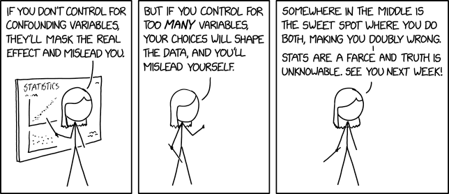

```{r setup, include=FALSE}
knitr::opts_chunk$set(echo = FALSE)
# Learn more about creating websites with Distill at:
# https://rstudio.github.io/distill/website.html
```

```{r fig.cap = "[Confounding Variables](https://www.explainxkcd.com/wiki/index.php/2560:_Confounding_Variables)", out.width = "200%"}

```
